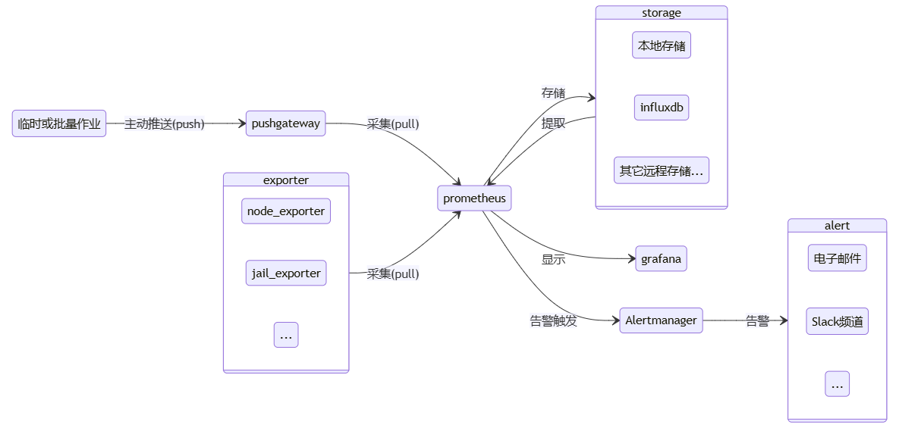
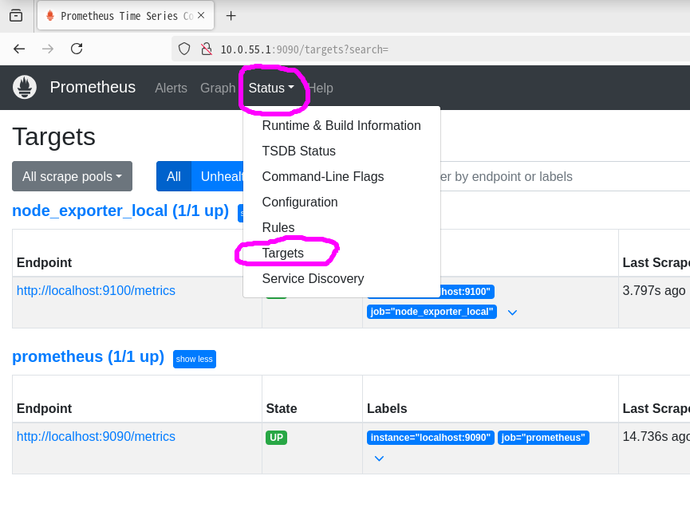
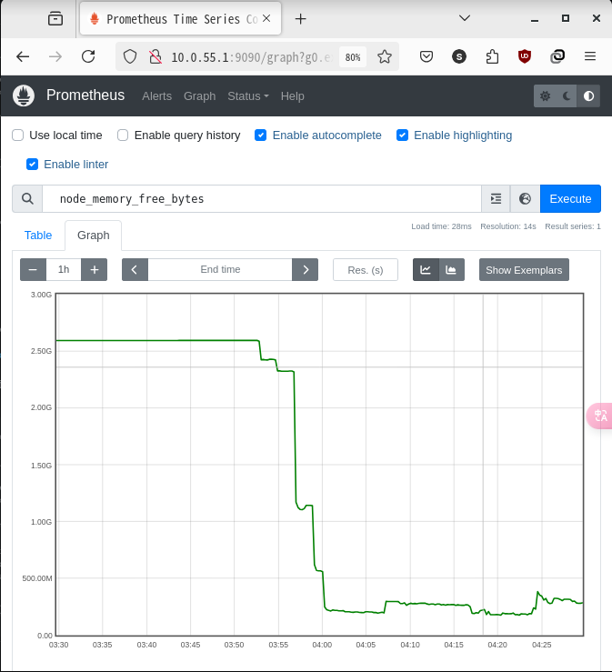
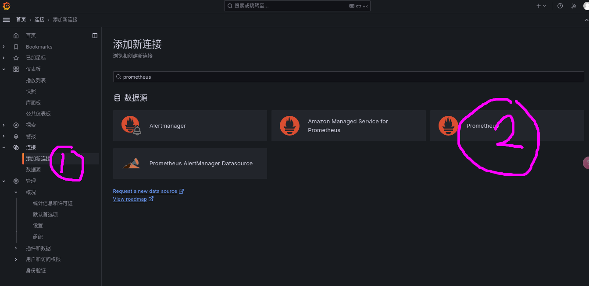
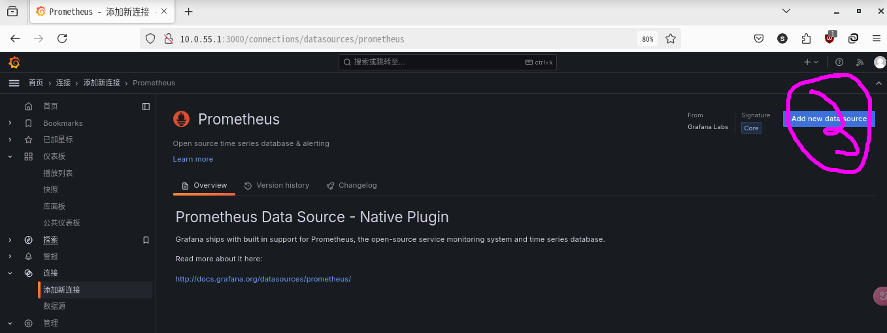
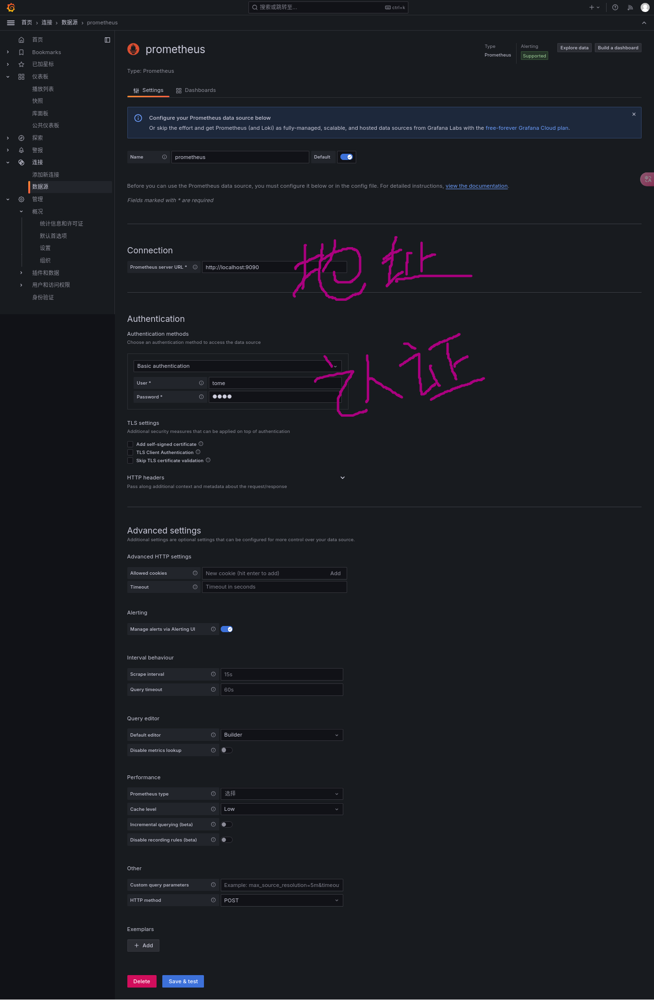
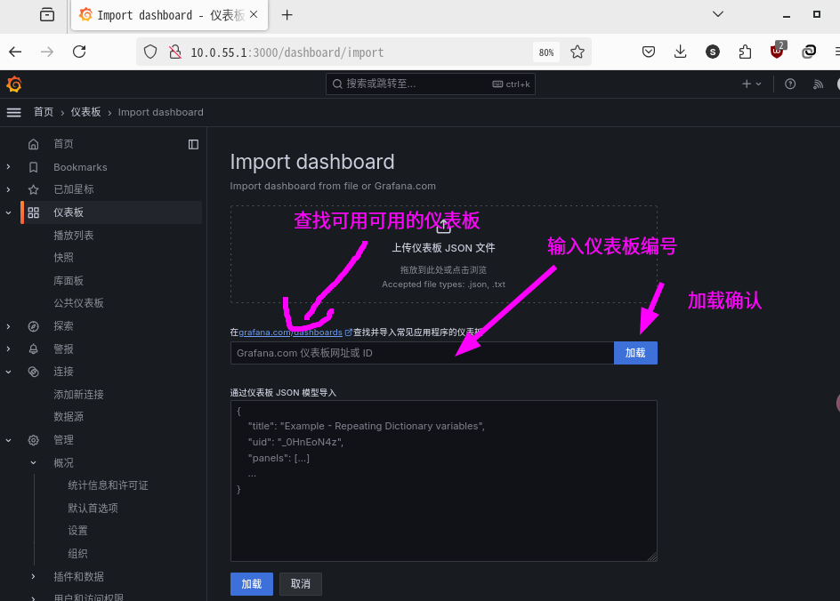
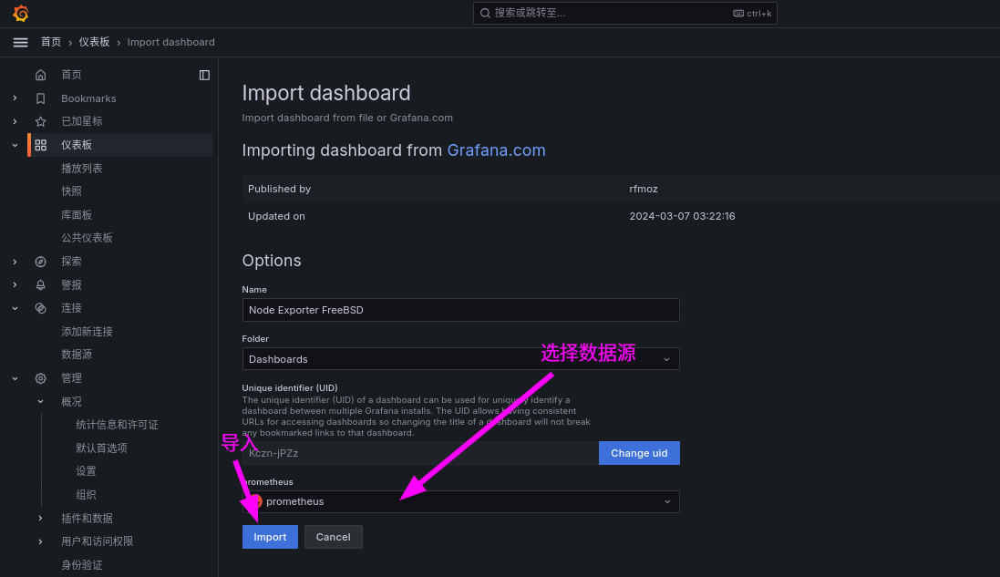
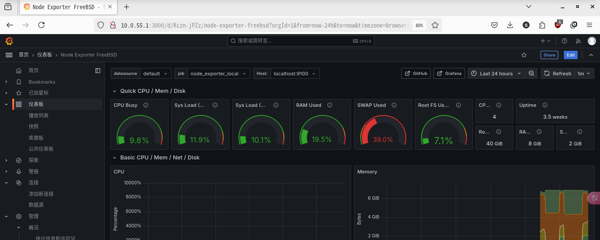
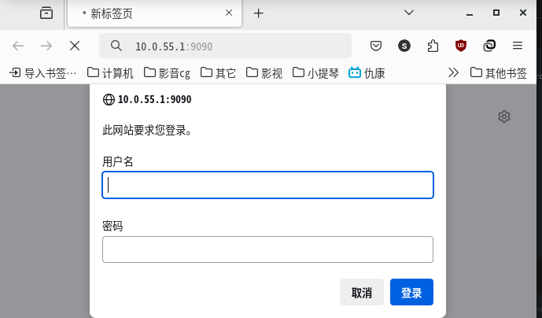

# 第 17.10 节 prometheus 监控部署

## 框架



prometheus 监控部署如图

- prometheus 是整个监控的中心
- grafana 用于图表化显示监控数据
- exporter 用于数据采集；prometheus 支持多种 exporter：可用 `pkg search -L name -D prometheus` 查找
- alertmanager 用于处理警告
- prometheus 可以使用多种远程存储

注意：prometheus､grafana､exporter alertmanager 等都不需要在同一台机器或相同系统上，exporter 安装在被监控的结点上。以下 prometheus、grafana、alertmanager 安装在同一机器上，exporter 根据需要来。

另：如果遇到服务开启问题先查香 `/var/log/daemon.log`。配置文件大部分为 yaml 格式，注意缩进。如果是 prometheus，可以用 `promtool check` 先检查正确与否。

## 安装基本工具

### 安装 prometheus

```sh
# pkg install prometheus2
```

或者：

```
# cd /usr/ports/net-mgmt/prometheus2/ 
# make install clean
```

#### 服务项

```sh
# service prometheus enable
# service prometheus start
```

### 安装 grafana

```sh
# pkg install grafana
```

或者：

```sh
# cd /usr/ports/www/grafana/ 
# make install clean
```

#### 服务项

```sh
# service grafana enable
# service grafana start
```

### 安装 node_exporter

```sh
# pkg install node_exporter
```

或者：

```sh
# cd /usr/ports/sysutils/node_exporter/ 
# make install clean
```

#### 服务项

```sh
# service node_exporter enable
# service node_exporter start
```

## 配置

### prometheus
   prometheus 的主要配置文件是 `/usr/local/etc/prometheus.yml`,在其中找到：

```yml
scrape_configs:
  # The job name is added as a label `job=<job_name>` to any timeseries scraped from this config.
  - job_name: "prometheus"

    # metrics_path defaults to '/metrics'
    # scheme defaults to 'http'.

    static_configs:
      - targets: ["localhost:9090"]
```

`scrape_configs` 是用于配置采集数据的结点，这里默认的 `targets: ["localhost:9090"]` 是 prometheus 服务本身。

现在增加用于监控主机信息的 `node_exporter`，在 `scrape_configs` 下写入如下：

```ini
scrape_configs:
  # The job name is added as a label `job=<job_name>` to any timeseries scraped from this config.
  - job_name: "prometheus"

    # metrics_path defaults to '/metrics'
    # scheme defaults to 'http'.

    static_configs:
      - targets: ["localhost:9090"]

  - job_name: "node_exporter_local"
    static_configs:
      - targets: ["localhost:9100"]
```

重启 prometheus：

```sh
service prometheus restart
```

这样就向 prometheus 增加了一个新的监控节点，任务名是 `node_exporter_local`。别外 `[]` 中可以加入多个主机。

prometheus 提供 web 界面(默认端口号：9090），查看监控目标信息如下：



Graph 页：可以查看各项监控指标，支持表达式。例如：



稍微熟悉一下界面，就可以发现查看数据、查看 panel 等并不方便。这时就要用到 grafana，以更友好的方式展示数据。

### grafana

浏览器打开 grafana 的 web 页（默认端口 `3000`）：默认用户名 `admin`，密码 `admin`。如下图可切换中文界面


先新建与 prometheus 的连接







用创建的连接建立仪表板(导入预设仪表板)









## 安全认证

在默认情况下，只有登录 grafana 需要密码。各部件间以 http 连接：如 `node_exporter` 可以通过访问 `http://ip:9100/` 直接获取所以监控数据；prometheus 可以通过 `http://ip:9090/` 直接访问。非实验环境中直接暴露这些信息是不安全的，所以安全认证是必要的。

### 基本认证

#### prometheus 的 basic_auth

- 编辑 `/usr/local/etc/prometheus_webconfig.yml`，格式如下

```yml
basic_auth_users:
  prometheususer: $2a$10$mxpc1PdYgOwvGepNtCuBKO6RXVUzLDg8feOvuz6szOsBa9M28ECfe
```

第二行中：冒号前为用户名，冒号后为密码的 bcrypt 哈希值——这里使用了 sttr 工具生成，也可以用其它工具,这里假设密码为 `prometheuspassword`:

```sh
# pkg install sttr
$ sttr bcrypt prometheuspassword
$2a$10$mxpc1PdYgOwvGepNtCuBKO6RXVUzLDg8feOvuz6szOsBa9M28ECfe%
```

这里的 `%` 只是终端里的输出在没有换行符时出现的，忽略即可。

- 编辑 `/usr/local/etc/prometheus.yml`

在 prometheus 的配置下加入下面三行，注意缩进：

```yml
scrape_configs:
  # The job name is added as a label `job=<job_name>` to any timeseries scraped from this config.
  - job_name: "prometheus"

    # metrics_path defaults to '/metrics'
    # scheme defaults to 'http'.

    static_configs:
      - targets: ["localhost:9090"]
    basic_auth:
      username: prometheususer
      password: prometheuspassword

  - job_name: "node_exporter_local"
    static_configs:
      - targets: ["localhost:9100"]
```

- 修改 prometheus 启动配置，并重启

```sh
# sysrc prometheus_args="--web.config.file='/usr/local/etc/prometheus_webconfig.yml'"
# service prometheus restart
```

访问 `http://ip:9090/` 此时，prometheus 会要求先登录



相应的 grafana 在连接数据源时要设置相应认证信息

#### exporter 的 basic_auth

下面以 node_exporter 为例

- 编辑 `/usr/local/etc/node_exporter_webconfig.yml`，格式如下

```yml
basic_auth_users:
  node_exporter_user: $2a$10$XoJoz.x.m9FTEbaTF3hBsehE9C8zCWjCQUHkSL0Isk53UnUTjR4hi
```

- 修改 node_exporter 启动配置，并重启

```
# sysrc node_exporter_args="--web.config.file='/usr/local/etc/node_exporter_webconfig.yml'"
# service node_exporter restart
```

- 编辑 `/usr/local/etc/prometheus.yml`，如下：

```yml
scrape_configs:
  # The job name is added as a label `job=<job_name>` to any timeseries scraped from this config.
  - job_name: "prometheus"

    # metrics_path defaults to '/metrics'
    # scheme defaults to 'http'.

    static_configs:
      - targets: ["localhost:9090"]
    basic_auth:
      username: tome
      password: jake

- job_name: "node_exporter_local"
    static_configs:
      - targets: ["localhost:9100"]
    basic_auth:
      username: node_exporter_user
      password: node_exporter_password
```

重启 prometheus

```sh
service prometheus restart
```

### ca 证书认证

对安全要求很高的情况下，还可以使用 ca 证书认证方式加强安全，但是这不是每个 exporter 都支持这个认证方式。

下面还是以 node_exporter 为例，假设 node_exporter 结点 ip 为 10.0.11.1。

#### 生成证书

```sh
# 生成 CA 私钥
openssl genpkey -algorithm RSA -out ca.key
# 生成 CA 证书
openssl req -new -x509 -key ca.key -out ca.crt -days 3650 -subj "/CN=my-ca"
```

#### 生成 prometheus 端证书

```sh
# 生成 Prometheus 客户端私钥
openssl genpkey -algorithm RSA -out prometheus.key
# 生成客户端证书请求
openssl req -new -key prometheus.key -out prometheus.csr -subj "/CN=prometheus-client"
# 使用 CA 对客户端证书请求进行签名
openssl x509 -req -in prometheus.csr -CA ca.crt -CAkey ca.key -CAcreateserial -out prometheus.crt -days 3650
```

#### 生成 node_exporter 端证书

1. 创建一个 OpenSSL 配置文件，以便在生成证书时指定 SAN（Subject Alternative Name）。

创建一个文件，比如叫 san.cnf。内容如下：

```ini
[ req ]
distinguished_name = req_distinguished_name
x509_extensions = v3_ca
prompt = no

[ req_distinguished_name ]
CN = node-exporter-server

[ v3_ca ]
# 添加 SAN 字段
subjectAltName = @alt_names

[ alt_names ]
DNS.1 = node-exporter-server.example.com  # 如果你有域名，添加它
IP.1 = 10.0.55.1  # 如果你用的是 IP 地址，添加它
```

2. 生成证书请求时使用 SAN 配置

使用这个配置文件来生成证书签名请求（CSR）和证书。

```sh
# 首先，生成私钥
openssl genpkey -algorithm RSA -out node_exporter.key
#然后，生成带有 SAN 字段的 CSR：
openssl req -new -key node_exporter.key -out node_exporter.csr -config san.cnf
用 CA 签署证书
openssl x509 -req -in node_exporter.csr -CA ca.crt -CAkey ca.key -CAcreateserial -out node_exporter.crt -days 3650 -extensions v3_ca -extfile san.cnf
```

指定 SAN （Subject Alternative Name）比较重要，不然可能不能访问。也可以在 prometheus 中配置忽略证书验证，但这和安全相悖，所以这里不再提及。

#### 配置 prometheus 和 node_exporter

编辑 `/usr/local/etc/node_exporter_webconfig.yml`，如下：

```yml
tls_server_config:
  cert_file: /path/to/node_exporter.crt
  key_file: /path/to/node_exporter.key
  client_ca_file: /path/to/ca.crt
  client_auth_type: "RequireAndVerifyClientCert"
```

最后一句重要，只有这个选项才是安全的。

修改 `/usr/local/etc/prometheus.yml`

```yml
  - job_name: "node_exporter_local"
    static_configs:
      - targets: ["10.0.55.1:9100"]
    scheme: 'https'
    tls_config:
      cert_file: '/path/to/prometheus.crt'
      key_file: '/path/to/prometheus.key'
      ca_file: '/path/to/ca.crt'
```

这两个文件在 [基本认证](#基本认证) 中已经提及，用法相同。

另外注意秘钥和证书文件的存放位置和权限，只给出最低访问权限。

重启 prometheus 和 node_exporter 即可。

## pushgateway

上面介绍的都是以 pull 方式，由 prometheus 从各个 exporter 拉取，pushgateway 则是监测点主动推送数据到 pushgateway，再由 prometheus 从 pushgateway 拉取数据。适合用于临时任务和批量任务。

1. 安装 pushgateway

```sh
# pkg install pushgateway
# service pushgateway enable
# service pushgateway start
```

2. 在 prometheus 中配置 pushgateway

编辑 `/usr/local/etc/prometheus.yml` 增加下面内容：

```yml
  - job_name: "pushgateway"
    static_configs:
      - targets: ["localhost:9091"]
```

3. 临时任务举例

假设有一个查看僵尸进程的管理脚本，如下：

```sh
num=$(ps aux |awk 'NR>1 {print $8}'|grep Z|wc -l)
echo "process_zombie $num"|curl --data-binary @- http://10.0.55.1:9091/metrics/job/check_processes
```

第一行用于检查僵尸进程数，第二行向 pushgateway 发送僵尸进程计数。（注意：发送的数据每行必须 `"\n"` 结尾

## 告警

prometheus 告警依赖 alertmanager 组件。这里示例以 jail_exporter 为例（安装配置较为简单，参见上文，不再说明。另需要 `/boot/loader.conf` 中写入 `kern.racct.enable=1`，以开启系统记帐功能）。

1. 安装：

```sh
# pkg install alertmanager
```

2. 配置 alertmanager 告警路由规则

这里只展示简单的 email 方式，alertmanager 也支持其它方式通知。

```yml
global:
  smtp_smarthost: 'smtp.sina.com:25'
  smtp_from: 'xxxxx@sina.com'
  smtp_auth_username: 'xxxxx'
  smtp_auth_password: 'xxxxxxxxxxxxxxx'
templates:
  - '/etc/alertmanager/template/*.tmpl'
route:
  group_by: ['alertname']
  group_wait: 30s
  group_interval: 5m
  repeat_interval: 3h
  receiver: safreya

  routes:
    - matchers:
        - alertname=~"jail"
      receiver: xxxxx
      routes:
        - matchers:
            - severity="critical"
          receiver: xxxxx

receivers:
  - name: 'xxxxx'
    email_configs:
      - to: 'xxxxx@qq.com'
```

其中 global 指定全局配置，这里指定了 smtp 服务。route 指定发送路由规则。receivers 指定接收者信息。

3. 配置告警规则

编写一个规则文件，如 `/usr/local/etc/prometheus/alert.rules.yml`:

```yml
groups:
- name: jails-alerts
  rules:
  - alert: jail_down
    expr: absent(jail_id{name="dox"})
    for: 5m
    labels:
      severity: critical
    annotations:
      summary: "jail dox is down"
      description: "jail dox is down"
```

`alert` 指定告警的名字。

`expr` 指定告警触发条件表达式，这里是名为 dox 的 jail。如果没有 jail id ，则触发告警。

`for` 指触发告警的等待时间，这里是 5 分钟。即如果在 5 分钟内得到解决，则不发送告警

4. 在 prometheus 配置文件中引入规则文件，并连接 alertmanager

```yml
# Alertmanager configuration
alerting:
  alertmanagers:
    - static_configs:
        - targets:
          - 10.0.55.1:9093

# Load rules once and periodically evaluate them according to the global 'evaluation_interval'.
rule_files:
  # - "first_rules.yml"
  # - "second_rules.yml"
  - "/usr/local/etc/prometheus/alert.rules.yml"
```

5. 重启 prometheus 和 alertmanager

```sh
service prometheus restart
service alertmanager restart
```

6. 测试

`jail -r dox` 关闭 jail，触发规则，5 分钟后发送告警邮件。`jail -c dox` 开启 jail，告警规则重置为非活动。

## 远程存储

prometheus 的数据支持远程存储。下面以 influxdb 为例。

1. 安装配置 influxdb ：

```sh
# pkg install influxdb
# service influxd enable
# service influxd start
```

注意 influxdb 的服务名是 influxd。

考虑安全问题应该修写 `/usr/local/etc/influxd.conf`，在 http 段开启 http 认证：

```ini
[http]
auth-enabled = true
```

2. 创建 influxdb 用户和数据库

用 `influx` 进入命令行客户端

```sh
create database "prometheus"
create user prometheus with password '123'
grant read on prometheus to prometheus
grant write on prometheus to prometheus
```

重启 influxdb 即可。

3. 配置 prometheus 以连接

编辑 `/usr/local/etc/prometheus.yml`

```yml
remote_write:
  - url: "http://10.0.55.1:8086/api/v1/prom/write?db=prometheus&u=prometheus&p=123"
remote_read:
  - url: "http://10.0.55.1:8086/api/v1/prom/read?db=prometheus&u=prometheus&p=123"
```

FreeBSD 的 pkg 中 influxdb 是 v1 版本，用 v1 的 api 配置

重启 prometheus 即可。

4. 验证

用 `influx` 命令进行数据库，查询数据指标即可：

```sh
use prometheus
select * from jail_id
1739497283285000000 jail_id  192.168.0.100:9452 jail_exporter prometheus 1
1739497298285000000 jail_id  192.168.0.100:9452 jail_exporter dox        4
1739497298285000000 jail_id  192.168.0.100:9452 jail_exporter prometheus 1
1739497313285000000 jail_id  192.168.0.100:9452 jail_exporter dox        4
1739497313285000000 jail_id  192.168.0.100:9452 jail_exporter prometheus 1
1739497328285000000 jail_id  192.168.0.100:9452 jail_exporter dox        4
1739497328285000000 jail_id  192.168.0.100:9452 jail_exporter prometheus 1
1739497343285000000 jail_id  192.168.0.100:9452 jail_exporter dox        4
1739497343285000000 jail_id  192.168.0.100:9452 jail_exporter prometheus 1
1739497358285000000 jail_id  192.168.0.100:9452 jail_exporter dox        4
1739497358285000000 jail_id  192.168.0.100:9452 jail_exporter prometheus 1
1739497373285000000 jail_id  192.168.0.100:9452 jail_exporter dox        4
1739497373285000000 jail_id  192.168.0.100:9452 jail_exporter prometheus 1
```

## 参考文献

[exporter 配置参考](https://github.com/prometheus/exporter-toolkit/blob/master/docs/web-configuration.md)

[prometheus 配置参考](https://github.com/prometheus/prometheus/blob/main/docs/configuration/configuration.md)

[远程存储相关](https://prometheus.io/docs/operating/integrations/#remote-endpoints-and-storage)

[alertmanager 配置参考](https://prometheus.io/docs/alerting/latest/configuration/)
