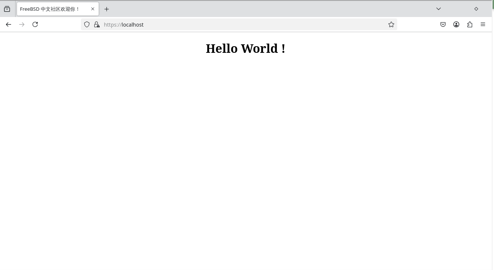

# 第 17.13 节 Caddy

## 安装

```sh
# pkg ins caddy
```

或

```sh
# cd /usr/ports/www/caddy/ 
# make install clean
```

## 查看安装后配置

```sh
root@ykla:~ #
root@ykla:~ # pkg info -D caddy
caddy-2.9.1:
On install:
To enable caddy:

- Edit /usr/local/etc/caddy/Caddyfile
  See https://caddyserver.com/docs/
- Run 'service caddy enable'

Note while Caddy currently defaults to running as root:wheel, it is strongly
recommended to run the server as an unprivileged user, such as www:www --

- Use security/portacl-rc to enable privileged port binding:

  # pkg install security/portacl-rc
  # sysrc portacl_users+=www
  # sysrc portacl_user_www_tcp="http https"
  # sysrc portacl_user_www_udp="https"
  # service portacl enable
  # service portacl start

- Configure caddy to run as www:www

  # sysrc caddy_user=www caddy_group=www

- Note if Caddy has been started as root previously, files in
  /var/log/caddy, /var/db/caddy, and /var/run/caddy may require their ownership
  changing manually.

/usr/local/etc/rc.d/caddy has the following defaults:

- Server log: /var/log/caddy/caddy.log
  (runtime messages, NOT an access.log)
- Automatic SSL certificate storage: /var/db/caddy/data/caddy/
- Administration endpoint: //unix/var/run/caddy/caddy.sock
- Runs as root:wheel (this will change to www:www in the future)

On upgrade from caddy<2.3.0:
The default locations for caddy runtime files have changed!

- Caddy's runtime log is now /var/log/caddy/caddy.log
  (was /var/log/caddy.log)

- Automatic SSL certs are now stored in /var/db/caddy/data/caddy
  (was /root/.local/share/caddy)

- Configuration autosaves are now stored in /var/db/caddy/config/caddy
  (was /root/.config/caddy)

You can change these defaults. See /usr/local/etc/rc.d/caddy

On upgrade from caddy<2.7.4_2:
The default Caddy administration endpoint location has been changed from
localhost:2019 to a protected Unix domain socket located in
/var/run/caddy/caddy.sock

This can be overridden with the `caddy_admin` rc variable, or by specifiying
an alternative in the Caddyfile `admin` section, documented here:

  https://caddyserver.com/docs/caddyfile/options#admin

The previous default, particularly paired with the server running as root,
may have serious security implications for shared machines with untrusted
users.

On upgrade:
It is STRONGLY RECOMMENDED to run Caddy as an unprivileged user, such as
www:www, rather than the current default of root:wheel.

If you have relied upon earlier defaults:

- Use security/portacl-rc to enable privileged port binding:

  # pkg install security/portacl-rc
  # sysrc portacl_users+=www
  # sysrc portacl_user_www_tcp="http https"
  # sysrc portacl_user_www_udp="https"
  # service portacl enable
  # service portacl start

- Stop the server, and update ownership on Caddy runtime files:

  # service caddy stop
  # chown -R www:www /var/db/caddy /var/log/caddy /var/run/caddy

Other changes may be necessary depending on your exact Caddy
configuration.

- Change the default runtime user, and restart the server:

  # sysrc caddy_user=www caddy_group=www
  # service caddy start
```

## 配置

>**注意**
>
>由于非特权用户无法开启 443 端口，会报错 `listen tcp :443: bind: permission denied`。

安装上文提到的 `security/portacl-rc`：

```sh
# pkg install security/portacl-rc
# sysrc portacl_users+=www
# sysrc portacl_user_www_tcp="http https"
# sysrc portacl_user_www_udp="https"
# service portacl enable
# service portacl start
```

配置服务：

```sh
# service caddy enable # 请按顺序执行
# service caddy start # 请按顺序执行
# service caddy stop # 请按顺序执行
# sysrc caddy_user=www caddy_group=www
# chown -R www:www /var/db/caddy /var/log/caddy /var/run/caddy
```

新建测试页面：

```sh
# mkdir -p /usr/local/www/caddy/
```

编辑 `/usr/local/www/caddy/index.html`，写入：

```html
<!DOCTYPE html>
<html lang="en">
<head>
    <meta charset="UTF-8">
    <meta name="viewport" content="width=device-width, initial-scale=1.0">
    <title>FreeBSD 中文社区欢迎你！</title>
</head>
<body>
    <h1 style="text-align: center;">Hello World !</h1>
</body>
</html>
```

```
root@ykla:~ # service caddy start
Starting caddy... done
Log: /var/log/caddy/caddy.log
```

在本机打开 `https://localhost/`：



### 参考文献

- [Caddy 安装与使用教程](https://blog.ovvv.top/posts/f3ac7ef6/)，本文测试页面的 HTML 来自此处

