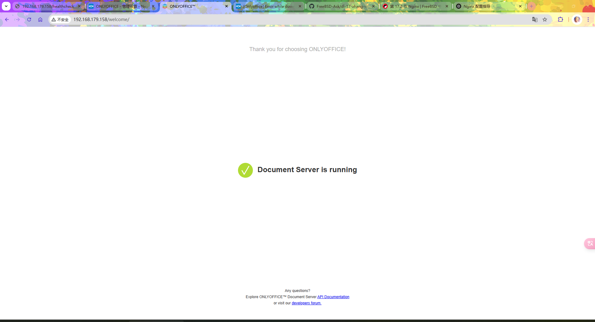
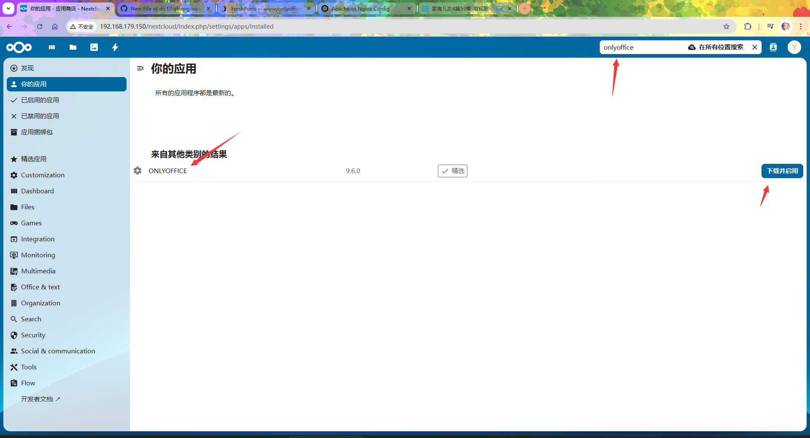
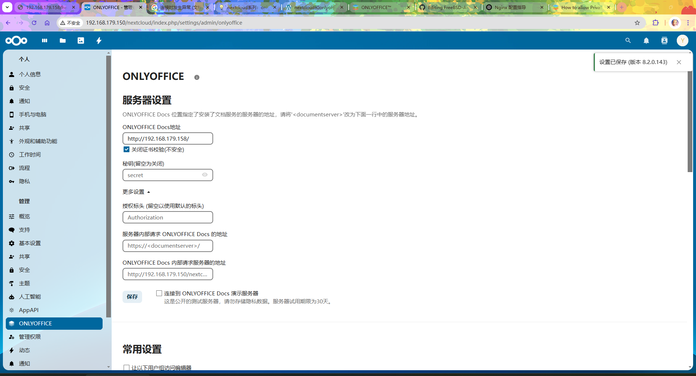
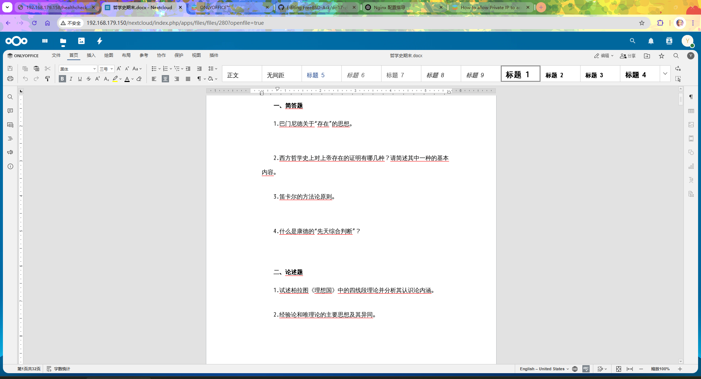
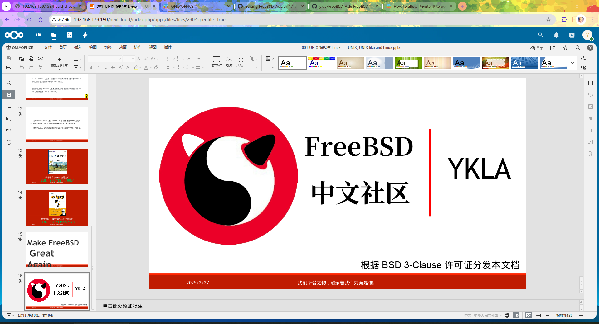
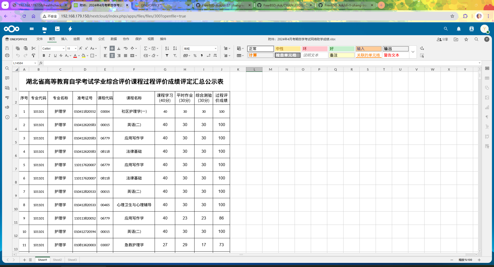

# 第 17.14 节 OnlyOffice（基于 PostgreSQL）

首先在其他机器上安装 nextcloud。

## 安装

```sh
# pkg install onlyoffice-documentserver
```

或者

```sh
# cd /usr/ports/www/onlyoffice-documentserver/ 
# make install clean
```

## 查看安装后配置

```sh
root@ykla:~ # pkg info -D onlyoffice-documentserver
onlyoffice-documentserver-8.2.0.143_4:
On install:
CONFIGURATION:
-------------
The configuration file can be found (or created) at the following path:
  /usr/local/etc/onlyoffice/documentserver/local.json
The default values are available in the default.json configuration file,
which is available in the folders above. Please do not edit the contents of the
default.json file directly. The default values will be restored each time you
upgrade Document Server to a new version and all your changes will be lost.

1. Enable services at startup in the /etc/rc.conf file:
  nginx_enable="YES"
  rabbitmq_enable="YES"
  supervisord_enable="YES"

  Optionally in case of a jail with local IP and no internet access:
    update /etc/hosts in order to resolve your nextcloud server to its local IP

2. Install a database server and set up the database (either PostgreSQL or MySQL):
  For PostgreSQL (don't forget to change the password):
    # service postgresql initdb
    # service postgresql start
    # psql -U postgres -c "CREATE DATABASE onlyoffice;"
    # psql -U postgres -c "CREATE USER onlyoffice WITH password 'onlyoffice';"
    # psql -U postgres -c "GRANT ALL privileges ON DATABASE onlyoffice TO onlyoffice;"
    # psql -U postgres -c "ALTER DATABASE onlyoffice OWNER to onlyoffice;"
    # psql -hlocalhost -Uonlyoffice -d onlyoffice -f /usr/local/www/onlyoffice/documentserver/server/schema/postgresql/createdb.sql

    Optionally in case of a jail with local IP:
      update /var/db/postgres/data13/pg_hba.conf accordingly

  For MySQL don't forget to change the password):
    # service mysql-server start
    # mysql -u root -p -e "CREATE DATABASE onlyoffice DEFAULT CHARACTER SET utf8 DEFAULT COLLATE utf8_general_ci;"
    # mysql -u root -p -e "CREATE USER 'onlyoffice'@'localhost' IDENTIFIED BY 'onlyoffice';"
    # mysql -u root -p -e "GRANT ALL privileges ON  onlyoffice.* TO 'onlyoffice'@'localhost';"
    # mysql -u onlyoffice -D onlyoffice -p < /usr/local/www/onlyoffice/documentserver/server/schema/mysql/createdb.sql

3. Create a new rabbitmq user for the ONLYOFFICE Document Server configuration (don't forget to change the password):
  # service rabbitmq start
  # rabbitmqctl --erlang-cookie `cat /var/db/rabbitmq/.erlang.cookie` add_user onlyoffice password
  # rabbitmqctl --erlang-cookie `cat /var/db/rabbitmq/.erlang.cookie` set_user_tags onlyoffice administrator
  # rabbitmqctl --erlang-cookie `cat /var/db/rabbitmq/.erlang.cookie` set_permissions -p / onlyoffice ".*" ".*" ".*"
  and change it in /usr/local/etc/onlyoffice/documentserver/local.json accordingly.

4. Set up supervisord in order to execute documentserver services:
  - let supervisord.conf load files contained in this directory by adding to
    /usr/local/etc/supervisord.conf:
[include]
files = /usr/local/etc/onlyoffice/documentserver/supervisor/*.conf

  - start supervisord:
    # service supervisord start

5. Set up nginx:
  - For HTTP include the following in your /usr/local/etc/nginx/nginx.conf file:
      include /usr/local/etc/onlyoffice/documentserver/nginx/ds.conf;

NOTE: documentserver-update-securelink.sh will only update ./nginx/ds.conf and local.json under /usr/local/etc/onlyoffice/documentserver/!
  - run documentserver-update-securelink.sh once for creationg a verysecretstring

  - start nginx:
    # service nginx start

6. Follow the following doc If you want to use Onlyoffice with Nextcloud:
  - https://api.onlyoffice.com/editors/nextcloud

7. Install OnlyOffice plugins (you'll need internet):
  # /usr/local/bin/documentserver-pluginsmanager.sh --update=/usr/local/www/onlyoffice/documentserver/sdkjs-plugins/plugin-list-default.json

8. Enjoy.

On upgrade from onlyoffice-documentserver<7.1.0.215:
If you are upgrading onlyoffice-documentserver from a version prior to 7.1.0.215,
you need to update the database schema:
  For PostgreSQL:
    psql -U postgres -d onlyoffice -f /usr/local/www/onlyoffice/documentserver/server/schema/postgresql/upgrade/upgradev710.sql
  For MySQL:
    mysql -u onlyoffice -D onlyoffice -p < /usr/local/www/onlyoffice/documentserver/server/schema/mysql/upgrade/upgradev710.sql

On upgrade from onlyoffice-documentserver>7.1.0.215<7.2.1.34:
If you are upgrading onlyoffice-documentserver from a version prior to 7.2.1.34,
you need to update the database schema:
  For PostgreSQL:
    psql -U postgres -d onlyoffice -f /usr/local/www/onlyoffice/documentserver/server/schema/postgresql/upgrade/upgradev720.sql
  For MySQL:
    mysql -u onlyoffice -D onlyoffice -p < /usr/local/www/onlyoffice/documentserver/server/schema/mysql/upgrade/upgradev720.sql
```


## 配置服务

```sh
# service nginx enable
# service rabbitmq enable
# service supervisord enable
```

## 配置数据库

```sh
# pkg install postgresql16-server
# service postgresql enable
# service postgresql initdb
# service postgresql start
# psql -U postgres -c "CREATE DATABASE onlyoffice;"
# psql -U postgres -c "CREATE USER onlyoffice WITH password 'onlyoffice';"
# psql -U postgres -c "GRANT ALL privileges ON DATABASE onlyoffice TO onlyoffice;"
# psql -U postgres -c "ALTER DATABASE onlyoffice OWNER to onlyoffice;"
# psql -hlocalhost -Uonlyoffice -d onlyoffice -f /usr/local/www/onlyoffice/documentserver/server/schema/postgresql/createdb.sql
```

## 配置 rabbitmq

开启服务：

```sh
# service rabbitmq start
```

第一步：

```sh
# rabbitmqctl --erlang-cookie `cat /var/db/rabbitmq/.erlang.cookie` add_user onlyoffice password  # 注意：会卡几分钟，下同

Error: unable to perform an operation on node 'rabbit@ykla'. Please see diagnostics information and suggestions below.

Most common reasons for this are:

 * Target node is unreachable (e.g. due to hostname resolution, TCP connection or firewall issues)
 * CLI tool fails to authenticate with the server (e.g. due to CLI tool's Erlang cookie not matching that of the server)
 * Target node is not running

In addition to the diagnostics info below:

 * See the CLI, clustering and networking guides on https://rabbitmq.com/documentation.html to learn more
 * Consult server logs on node rabbit@ykla
 * If target node is configured to use long node names, don't forget to use --longnames with CLI tools

DIAGNOSTICS
===========

attempted to contact: [rabbit@ykla]

rabbit@ykla:
  * connected to epmd (port 4369) on ykla
  * epmd reports node 'rabbit' uses port 25672 for inter-node and CLI tool traffic
  * can't establish TCP connection to the target node, reason: timeout (timed out)
  * suggestion: check if host 'ykla' resolves, is reachable and ports 25672, 4369 are not blocked by firewall

Current node details:
 * node name: 'rabbitmqcli-719-rabbit@ykla'
 * effective user's home directory: /root
 * Erlang cookie hash: mmhdcv/DKEfjrCrCEaZMvQ==
```

第二步：

```sh
# rabbitmqctl --erlang-cookie `cat /var/db/rabbitmq/.erlang.cookie` set_user_tags onlyoffice administrator
Error: unable to perform an operation on node 'rabbit@ykla'. Please see diagnostics information and suggestions below.

Most common reasons for this are:

 * Target node is unreachable (e.g. due to hostname resolution, TCP connection or firewall issues)
 * CLI tool fails to authenticate with the server (e.g. due to CLI tool's Erlang cookie not matching that of the server)
 * Target node is not running

In addition to the diagnostics info below:

 * See the CLI, clustering and networking guides on https://rabbitmq.com/documentation.html to learn more
 * Consult server logs on node rabbit@ykla
 * If target node is configured to use long node names, don't forget to use --longnames with CLI tools

DIAGNOSTICS
===========

attempted to contact: [rabbit@ykla]

rabbit@ykla:
  * connected to epmd (port 4369) on ykla
  * epmd reports node 'rabbit' uses port 25672 for inter-node and CLI tool traffic
  * can't establish TCP connection to the target node, reason: timeout (timed out)
  * suggestion: check if host 'ykla' resolves, is reachable and ports 25672, 4369 are not blocked by firewall

Current node details:
 * node name: 'rabbitmqcli-882-rabbit@ykla'
 * effective user's home directory: /root
 * Erlang cookie hash: mmhdcv/DKEfjrCrCEaZMvQ==
```

第三步：

```sh
root@ykla:~ #  rabbitmqctl --erlang-cookie `cat /var/db/rabbitmq/.erlang.cookie` set_permissions -p / onlyoffice ".*" ".*" ".*"
Error: unable to perform an operation on node 'rabbit@ykla'. Please see diagnostics information and suggestions below.

Most common reasons for this are:

 * Target node is unreachable (e.g. due to hostname resolution, TCP connection or firewall issues)
 * CLI tool fails to authenticate with the server (e.g. due to CLI tool's Erlang cookie not matching that of the server)
 * Target node is not running

In addition to the diagnostics info below:

 * See the CLI, clustering and networking guides on https://rabbitmq.com/documentation.html to learn more
 * Consult server logs on node rabbit@ykla
 * If target node is configured to use long node names, don't forget to use --longnames with CLI tools

DIAGNOSTICS
===========

attempted to contact: [rabbit@ykla]

rabbit@ykla:
  * connected to epmd (port 4369) on ykla
  * epmd reports node 'rabbit' uses port 25672 for inter-node and CLI tool traffic
  * can't establish TCP connection to the target node, reason: timeout (timed out)
  * suggestion: check if host 'ykla' resolves, is reachable and ports 25672, 4369 are not blocked by firewall

Current node details:
 * node name: 'rabbitmqcli-636-rabbit@ykla'
 * effective user's home directory: /root
 * Erlang cookie hash: mmhdcv/DKEfjrCrCEaZMvQ==
```
## 允许局域网访问

onlyoffice 默认的配置，不允许私有地址访问。故需将以下片段加入 `/usr/local/etc/onlyoffice/documentserver/local.json`：

```ini
  "request-filtering-agent" : {
				"allowPrivateIPAddress": true,
				"allowMetaIPAddress": true
			},
```

即：

```ini
{
  "services": {
    "CoAuthoring": {
      "sql": {
        "type": "postgres",
        "dbHost": "localhost",
        "dbPort": "5432",
        "dbName": "onlyoffice",
        "dbUser": "onlyoffice",
        "dbPass": "onlyoffice"
      },
  "request-filtering-agent" : {
				"allowPrivateIPAddress": true,
				"allowMetaIPAddress": true
			},
      "token": {
        "enable": {
          "request": {
            "inbox": false,
            "outbox": false
          },
          "browser": false

……省略……
```

## 配置 nginx

编辑 `/usr/local/etc/nginx/nginx.conf`

把

```ini
include /usr/local/etc/onlyoffice/documentserver/nginx/ds.conf;
```

放到 http 的括号里：

示例：

```ini
……省略……
http {
    include       mime.types;
    default_type  application/octet-stream;
    include /usr/local/etc/onlyoffice/documentserver/nginx/ds.conf;

……省略……
```

## 配置 supervisord

编辑 `/usr/local/etc/supervisord.conf`，翻到最底下，找到 `;[include]`，并删去前面的分号：

即：

```ini
[include]
;files = relative/directory/*.ini
files = /usr/local/etc/onlyoffice/documentserver/supervisor/*.conf
```

```sh
# service supervisord start
```

## 启动文档

```sh
root@ykla:~ # documentserver-update-securelink.sh
ds:docservice: stopped
ds:docservice: started
ds:converter: stopped
ds:converter: started
Performing sanity check on nginx configuration:
nginx: the configuration file /usr/local/etc/nginx/nginx.conf syntax is ok
nginx: configuration file /usr/local/etc/nginx/nginx.conf test is successful
```

直接打开 IP 地址，应如下图所示：



## 配置 NextCloud

打开 NextCloud:

安装 onlyoffice 插件，可以直接访问 `ip/nextcloud/index.php/settings/apps/office/onlyoffice`：



点击头像——>管理设置，找到 onlyoffice，设置如下（注意看看那个密钥是不是真的为空)



## 完成

随便预览几个文件：







## 参考文献

- [How to allow Private IP to access onlyOffice documentServer?](https://forum.onlyoffice.com/t/how-to-allow-private-ip-to-access-onlyoffice-documentserver/5755/2)

## 故障排除

可以看日志 `cat /var/log/onlyoffice/documentserver/converter/out.log`。
