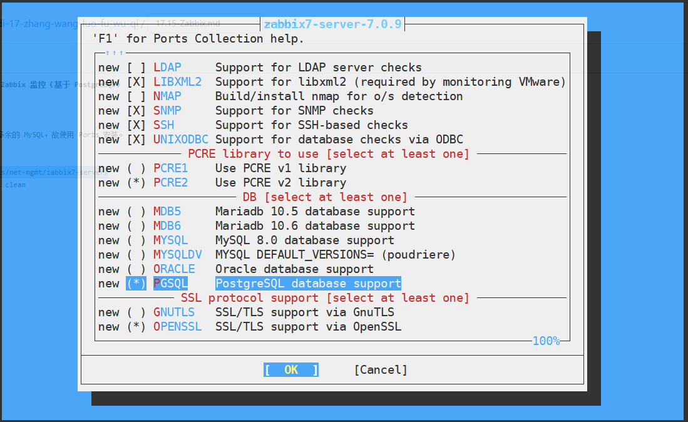
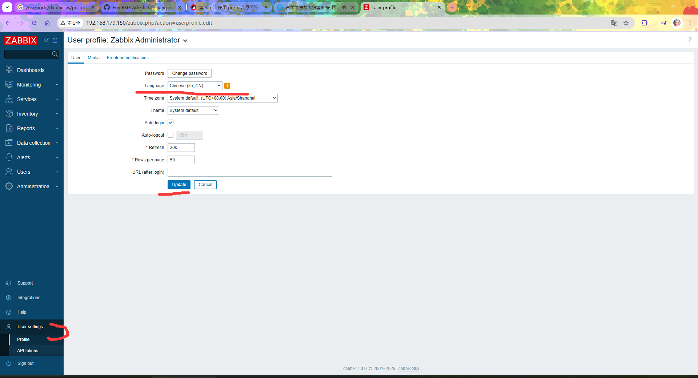
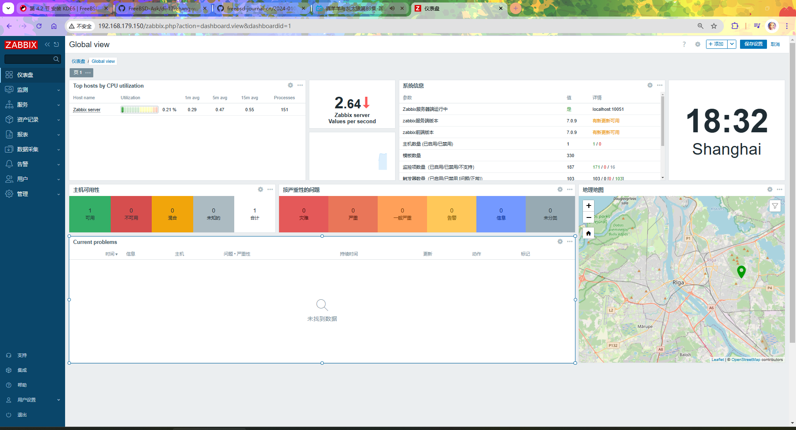
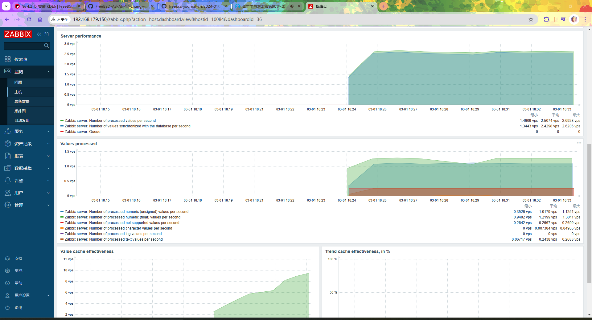

# 第 17.15 节 Zabbix 监控（基于 PostgreSQL）


## 安装 zabbix7-server

zabbix7-server 是服务器端。负责接收、处理监控数据，应运行在监控服务器上。
 
pkg 安装会安装多余的 MySQL（且会捆绑死），故使用 Ports 安装。

```sh
# cd /usr/ports/net-mgmt/zabbix7-server/ 
# make config
```



按如图配置，选中 `PGSQL` 后按回车键：

```sh
# make install clean
```


## 安装 PostgreSQL


安装：

```sh
# pkg install postgresql16-server postgresql16-client
```

或

```sh
# cd /usr/ports/databases/postgresql16-server/ && make install clean
# cd /usr/ports/databases/postgresql16-client/ && make install clean
```


## 安装 zabbix7-frontend 

zabbix7-frontend 是 web 控制前端。

```sh
# pkg ins zabbix7-frontend-php83
```

上述安装过程会自动安装 PHP，本文中安装的版本是 PHP8.3（写作本文时 PHP8.4 会报错），具体可用版本可以到 [zabbix7-frontend](https://www.freshports.org/net-mgmt/zabbix7-frontend) 看一下。

或者：

```sh
# cd /usr/ports/net-mgmt/zabbix7-frontend/ 
# make install clean
```


## Pdo

注意 PHP 版本：

```sh
# pkg ins php83-pdo_pgsql php83-pgsql
```

或

```sh
# cd /usr/ports/databases/php83-pdo_pgsql/ && make install clean
# cd /usr/ports/databases/php83-pgsql/ && make install clean
```


## 安装 zabbix7-agent

zabbix7-agent 负责数据采集，安装在被监控的服务器上。

```sh
# pkg install zabbix7-agent
```

或者

```sh
# cd /usr/ports/net-mgmt/zabbix7-agent/ 
# make install clean
```

## 安装 nginx

```sh
# pkg install nginx
```

```sh
# cd /usr/ports/www/nginx/ 
# make install clean
```

## 配置服务开机自启

```sh
# service zabbix_server enable
# service zabbix_agentd enable
# service postgresql enable
# service nginx enable
# service php_fpm enable
```

## 设置数据库

初始化数据库

```sql
# service postgresql initdb # 初始化数据库
# su - postgres # 切换到数据库用户
$ /usr/local/bin/pg_ctl -D /var/db/postgres/data16 -l logfile start # 初始化服务
$ cd /usr/local/share/zabbix7/server/database/postgresql/
$ psql 
psql (16.8)
Type "help" for help.

template1=# create database zabbix; # 创建 zabbix 数据库
CREATE DATABASE
template1=# CREATE USER zabbix WITH PASSWORD 'z'; # 此处设置用户 zabbix 密码为 z
CREATE ROLE
postgres=# GRANT USAGE, CREATE on SCHEMA PUBLIC to zabbix; #  授权
GRANT
postgres=# GRANT ALL PRIVILEGES ON DATABASE zabbix TO zabbix; # 在授予用户 zabbix 对 zabbix 数据库有所有权限
GRANT
postgres=# grant all on database zabbix to zabbix; #  授权
GRANT
postgres=# ALTER DATABASE zabbix owner to zabbix; #  授权
ALTER DATABASE
postgres=# \q
```

必须退出再继续：

```sql
$  psql -U zabbix zabbix # 使用用户账户 zabbix 登录到数据库 zabbix
psql (16.8, server 16.7)
Type "help" for help.

zabbix=> \i schema.sql # 导入数据库，下同
CREATE TABLE
CREATE INDEX
CREATE TABLE
CREATE INDEX
CREATE TABLE
……省略……

zabbix=> \i images.sql
INSERT 0 1
INSERT 0 1
INSERT 0 1
INSERT 0 1
INSERT 0 1
……省略……

zabbix=>  \i data.sql
START TRANSACTION
INSERT 0 4
INSERT 0 1
INSERT 0 2
……省略……
zabbix=# \q # 退出
$ exit # 退出数据库用户
root@ykla:~ # # 回来了
```

### 参考文献

- [PostgreSQL15 Public Schema没有权限问题解决](https://showme.codes/zh-cn/2024-01-01-postgresql15-public-schema-permission/)

## 设置 Zabbix Server

Zabbix 的主要配置文件位于 `/usr/local/etc/zabbix7/zabbix_server.conf`。

加入以下内容：

```ini
SourceIP=127.0.0.1
LogFile=/var/log/zabbix/zabbix_server.log
DBHost=
DBName=zabbix
DBUser=zabbix
DBPassword=z
Timeout=4
LogSlowQueries=3000
StatsAllowedIP=127.0.0.1
```

## 设置 Zabbix Agent

Zabbix Agent 配置文件位于 `/usr/local/etc/zabbix7/zabbix_agentd.conf`

加入以下内容：

```ini
LogFile=/var/log/zabbix/zabbix_agentd.log
SourceIP=127.0.0.1
Server=127.0.0.1
ServerActive=127.0.0.1
Hostname=ykla
```

## 配置 Zabbix 前端

Zabbix 前端配置文件模板位于 `/usr/local/www/zabbix7/conf/zabbix.conf.php.example`。

复制模板：

```sh
# cp /usr/local/www/zabbix7/conf/zabbix.conf.php.example /usr/local/www/zabbix7/conf/zabbix.conf.php
```

编辑 `/usr/local/www/zabbix7/conf/zabbix.conf.php`，将：

```ini
$DB['TYPE']                             = 'MYSQL';
$DB['SERVER']                   = 'localhost';
$DB['PORT']                             = '0';
$DB['DATABASE']                 = 'zabbix';
$DB['USER']                             = 'zabbix';
$DB['PASSWORD']                 = '';
```

修改如下：

```ini
$DB['TYPE']                             = 'POSTGRESQL'; #数据库改成这个
$DB['SERVER']                   = 'localhost';
$DB['PORT']                             = '0';
$DB['DATABASE']                 = 'zabbix';
$DB['USER']                             = 'zabbix';
$DB['PASSWORD']                 = 'z';  # 这里是你的数据库密码
```

### 配置 nginx

备份原有主要配置文件：

```sh
# cp /usr/local/etc/nginx/nginx.conf /usr/local/etc/nginx/nginx.conf.simple
```

编辑 `/usr/local/etc/nginx/nginx.conf`，清空原有内容，修改如下，

```ini
worker_processes 1;
events {
  worker_connections 1024;
}
http {
  include             mime.types;
  default_type        application/octet-stream;
  sendfile            on;
  keepalive_timeout   65;
  server {
    listen            80;
    server_name       localhost;
    root /usr/local/www/zabbix7;
    index index.php index.html index.htm;
    location / {
      try_files $uri $uri/ =404;
    }
    location ~ .php$ {
      fastcgi_split_path_info ^(.+\.php)(/.+)$;
      fastcgi_param SCRIPT_FILENAME $document_root$fastcgi_script_name;
      fastcgi_param PATH_INFO $fastcgi_path_info;
      fastcgi_param REMOTE_USER $remote_user;
      fastcgi_pass   127.0.0.1:9000;
      fastcgi_index index.php;
      include fastcgi_params;
    }

}}
```

## 配置 PHP

### 编辑 `/usr/local/etc/php.ini-production`

```sh
# cp /usr/local/etc/php.ini-production /usr/local/etc/php.ini
```

编辑 `/usr/local/etc/php.ini`：

- 找到 `;date.timezone =`修改为 `date.timezone = Asia/Shanghai`（注意要删掉原来开头的 `;`）
- 找到 `post_max_size = 8M` 修改为 `post_max_size = 16M`
- 找到 `max_execution_time = 30`，修改为 `max_execution_time = 300`
- 找到 `max_input_time = 60`，修改为 `max_input_time = 300`


## 启动服务

```sh
# service postgresql restart
# service php_fpm start
# service nginx start
# service zabbix_server start
# service zabbix_agentd start
```

## 登录


Zabbix 的默认用户名和密码如下：

- 用户名: `Admin`
- 密码: `zabbix`


## 配置中文







## 待解决

- 中文乱码
- 监控项不全
- HTTP 等安全设置

## 参考文献

- [Monitor Your Hosts with Zabbix](https://freebsdfoundation.org/our-work/journal/browser-based-edition/networking-10th-anniversary/practical-ports-monitor-your-hosts-with-zabbix/)
