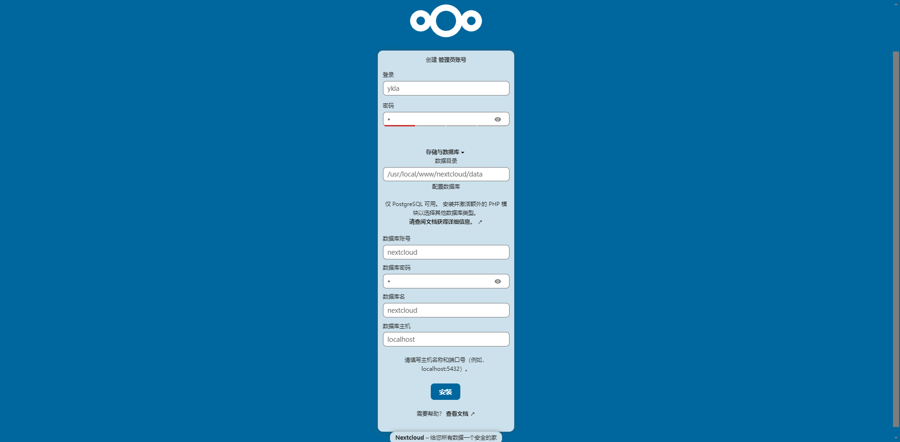
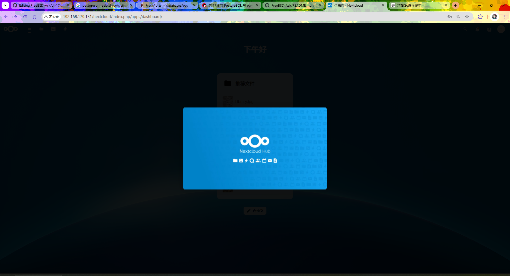
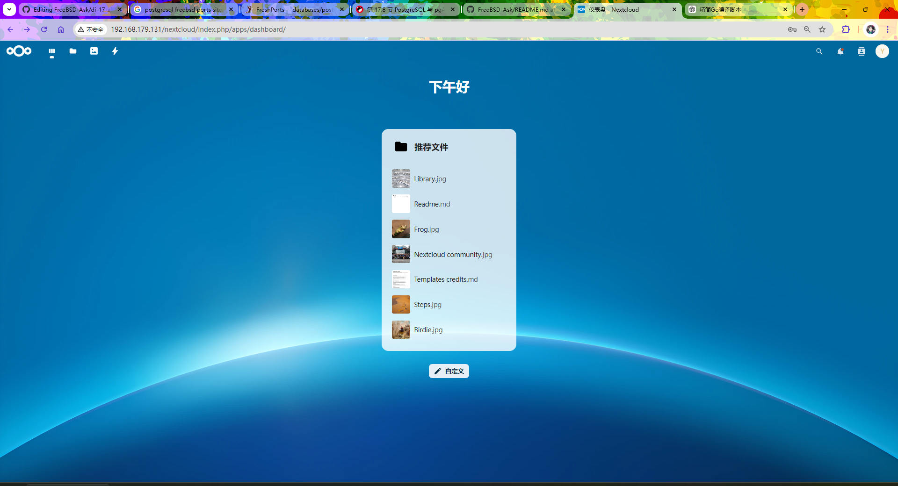

# 第 17.6 节 NextCloud——基于 PostgreSQL


## 安装 nextcloud

>**注意**
>
>本文写作时 Nextcloud 与 php84 尚不兼容，会显示以下内容：
>
>```sh
>This version of Nextcloud is not compatible with PHP>=8.4.
>You are currently running 8.4.0RC3.
>```

故，为了方便安装，请使用 Ports 而非 pkg：

```sh
# cd /usr/ports/www/nextcloud/
# make config # 为了方便，仅配置 nextcloud 本体
```

本文选中 `PostgreSQL`，`SMB`，`PCNTL`；取消勾选 MYSQL：


编译安装：

```sh
# make BATCH=yes install clean
```
## 安装配置 PostgreSQL

安装（请留意上面 ports 默认安装的 `postgresql-client` 版本，尽量一致）
 
```sh
# pkg install postgresql16-server
```

或者：

```sh
# cd /usr/ports/databases/postgresql16-server/ 
# make install clean
```

配置:

```sh
# sysrc postgresql_enable=YES
```

```sql
root@ykla:/usr/ports/www/nextcloud #  su - postgres #切换到数据库用户
$ /usr/local/bin/pg_ctl -D /var/db/postgres/data16/ -l logfile start # 初始化
waiting for server to start.... done
server started
$ psql -Upostgres # 进入命令模式
psql (16.4)
Type "help" for help.

postgres=# create user nextcloud; # 创建所需用户
CREATE ROLE
postgres=# \password nextcloud # 创建用户 nextcloud 密码，注意斜杠要输入：\ 
Enter new password for user "nextcloud": # 此处输入密码，密码不会显示到屏幕上，也不是 *，就是空的，下同
Enter it again: # 再次重复输入上面密码
postgres=# create database nextcloud owner=nextcloud; # 创建所需数据库的属主
CREATE DATABASE
postgres-# \q # 退出，注意斜杠要输入：\ 
```

>**技巧**
>
>远程访问数据库服务器请自行配置 `/var/db/postgres/data16/pg_hba.conf`。
>
>示例（IP 段 `10.0.50.5/32` 照抄不管用）：
>
>```sh
>host    nextcloud       nextcloud       10.0.50.5/32               scram-sha-256
>```

## 安装 Apache

```sh
# pkg install apache24
```

或者

```sh
# cd /usr/ports/www/apache24/ 
# make install clean
```

配置服务：

```sh
# sysrc apache24_enable=yes
```

## 安装 `mod_php`

注意版本可以通过 `php -v` 命令判断，必须一致：

```sh
root@ykla:/usr/ports/www/nextcloud # php -v
PHP 8.2.25 (cli) (built: Nov  1 2024 13:10:16) (NTS)
Copyright (c) The PHP Group
Zend Engine v4.2.25, Copyright (c) Zend Technologies
    with Zend OPcache v8.2.25, Copyright (c), by Zend Technologies
root@ykla:/usr/ports/www/nextcloud # 
```

```sh
# pkg install mod_php82
```

## 查看 Apache 配置方法

```sh
root@ykla:/usr/ports/www/nextcloud # pkg info -D nextcloud-php82
nextcloud-php82-30.0.1:
On install:
/!\ The FreeBSD package REQUIRES the apps_paths configuration as    /!\
/!\ seen in config/config.sample.php to function                    /!\

Please note that everything has been installed in /usr/local/www/nextcloud.

You will probably want to add an alias to your httpd.conf file,
something like this:

    	Alias /nextcloud /usr/local/www/nextcloud
	AcceptPathInfo On
	<Directory /usr/local/www/nextcloud>
	    AllowOverride All
	    Require all granted
	</Directory>

And restart Apache. Nextcloud will start the bundled installer on first
access. Once the bundled installer finishes, further configuration can
be done via 'Settings', 'Administration'. Additional configuration
options are available in

	/usr/local/www/nextcloud/config/config.php

You can find annotated configuration options in config.documented.php
in the same directory. Nextcloud's configuration documentation is at 

	https://docs.nextcloud.com/server/stable/admin_manual/configuration_server

The caching options require additional Nextcloud configuration.

On upgrade:
After a version migration you should upgrade your nextcloud instance
using command line:

  occ upgrade

Merge any changes to /usr/local/www/nextcloud/.htaccess.dist into .htaccess (above the
'#### DO NOT CHANGE ANYTHING ABOVE THIS LINE ####' divider if it exists)
and update the dynamic part of the file using the commandline:

  occ maintenance:update:htaccess

As of Nextcloud 27.1.0 the recommended PHP version is 8.2.
```

```sh
root@ykla:/usr/ports/www/nextcloud # pkg info -D mod_php82
mod_php82-8.2.25:
On install:
******************************************************************************

Consider switching to php-fpm and mod_fast_cgi as per Apache httpd project
recommendation. See https://cwiki.apache.org/confluence/display/HTTPD/PHP-FPM

******************************************************************************

If you are building PHP-based ports in poudriere(8) or Synth with ZTS enabled,
add WITH_MPM=event to /etc/make.conf to prevent build failures.

******************************************************************************

Make sure index.php is part of your DirectoryIndex.

You should add the following to your Apache configuration file:

<FilesMatch "\.php$">
    SetHandler application/x-httpd-php
</FilesMatch>
<FilesMatch "\.phps$">
    SetHandler application/x-httpd-php-source
</FilesMatch>

******************************************************************************
```

编辑 `/usr/local/etc/apache24/httpd.conf`，加入：

```json
<FilesMatch "\.php$">
    SetHandler application/x-httpd-php
</FilesMatch>
<FilesMatch "\.phps$">
    SetHandler application/x-httpd-php-source
</FilesMatch>

Alias /nextcloud /usr/local/www/nextcloud
    AcceptPathInfo On
<Directory /usr/local/www/nextcloud>
    AllowOverride All
    Require all granted
</Directory>
```

启动 Apache：

```sh
# service apache24 start
```

## 启动

`http://ip:nextcloud/i` 即可。请把 `ip` 替换成你的局域网 ip。



请输入你需要的登录账户和密码。其他照抄即可。


安装完成会重定向到插件推荐：不必理会，重新定位到 "http://ip/nextcloud" 即可正常使用之。





## 备注

常用插件，可以用 `pkg search -x nextcloud | grep php82` 查找，pkg 安装。

>**注意**
>
>之前有些版本在初始化 nextcloud 时，会有权限问题，请你检查 `/usr/local/www/nextcloud` 中 `config` 目录及其下文件的访问权限，看运行 `apache` 的用户是否可读写之。

## 参考文献

- [System requirements](https://docs.nextcloud.com/server/latest/admin_manual/installation/system_requirements.html)，各种软件的版本需求
- [PHP Modules & Configuration](https://docs.nextcloud.com/server/latest/admin_manual/installation/php_configuration.html)，需要和可选的 PHP 模块及配置
