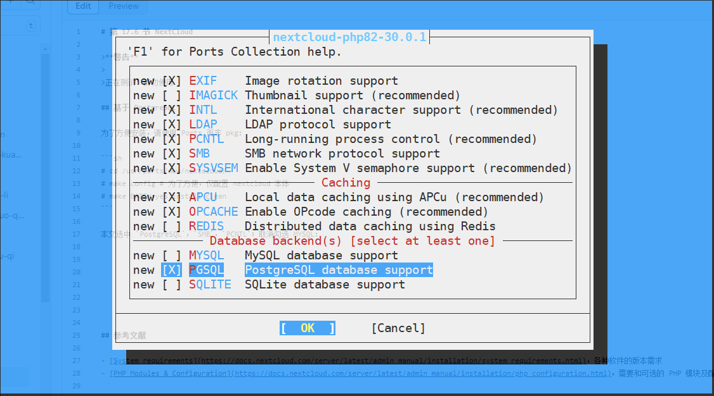
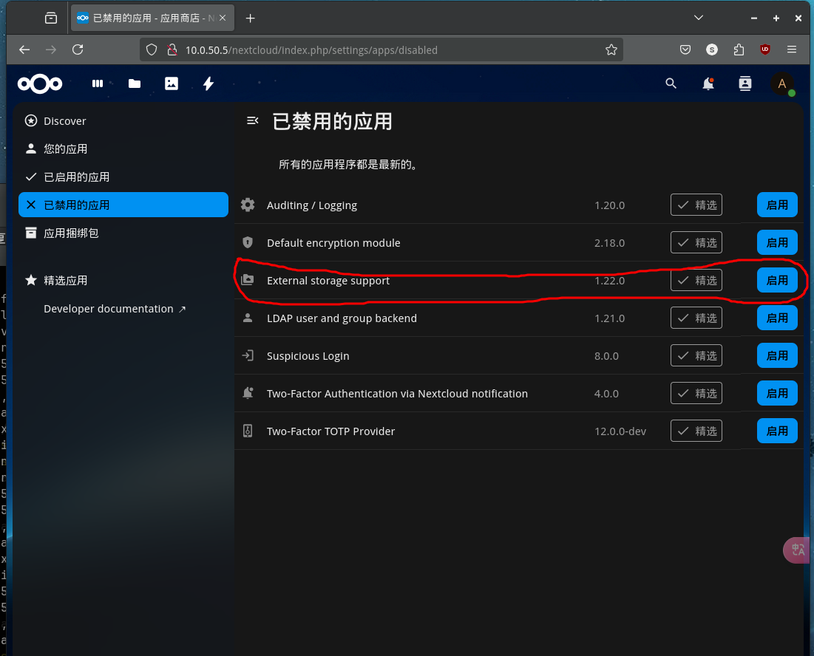
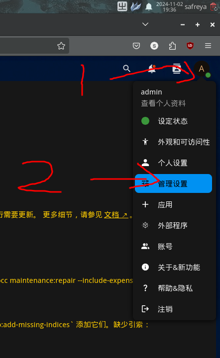
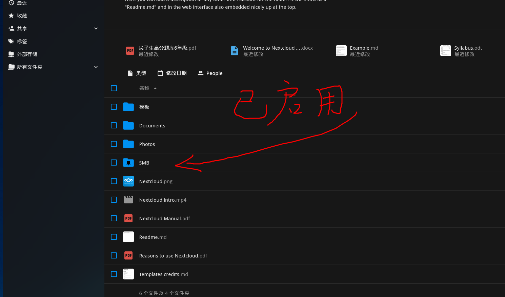

# 第 17.6 节 NextCloud——基于 PostgreSQL


## 安装 nextcloud


为了方便安装，请使用 Ports 而非 pkg：

```sh
# cd /usr/ports/www/nextcloud/
# make config # 为了方便，仅配置 nextcloud 本体
```

本文选中 `PGSQL`，`SMB`，`PCNTL`；取消勾选 `MYSQL`：



编译安装：

```sh
# make BATCH=yes install clean
```
## 安装配置 PostgreSQL

安装（请留意上面 ports 默认安装的 `postgresql-client` 版本，尽量一致）

>**注意**
>
>若使用 pkg 安装，请另行安装 `databases/php83-pdo_pgsql`，php 版本须同
 
```sh
# pkg install postgresql16-server
```

或者：

```sh
# cd /usr/ports/databases/postgresql16-server/ 
# make install clean
```

配置:

```sh
root@ykla:~ # service postgresql enable
postgresql enabled in /etc/rc.conf
```

初始化数据库

```sh
root@ykla:~ # service postgresql initdb
The files belonging to this database system will be owned by user "postgres".
This user must also own the server process.

The database cluster will be initialized with this locale configuration:
  provider:    libc
  LC_COLLATE:  C
  LC_CTYPE:    C.UTF-8
  LC_MESSAGES: C.UTF-8
  LC_MONETARY: C.UTF-8
  LC_NUMERIC:  C.UTF-8
  LC_TIME:     C.UTF-8
The default text search configuration will be set to "english".

Data page checksums are disabled.

creating directory /var/db/postgres/data16 ... ok
creating subdirectories ... ok
selecting dynamic shared memory implementation ... posix
selecting default max_connections ... 100
selecting default shared_buffers ... 128MB
selecting default time zone ... PRC
creating configuration files ... ok
running bootstrap script ... ok
performing post-bootstrap initialization ... ok
syncing data to disk ... ok

initdb: warning: enabling "trust" authentication for local connections
initdb: hint: You can change this by editing pg_hba.conf or using the option -A, or --auth-local and --auth-host, the next time you run initdb.

Success. You can now start the database server using:

    /usr/local/bin/pg_ctl -D /var/db/postgres/data16 -l logfile start

```

```sql
root@ykla:/usr/ports/www/nextcloud #  su - postgres #切换到数据库用户
$ /usr/local/bin/pg_ctl -D /var/db/postgres/data16/ -l logfile start # 初始化
waiting for server to start.... done
server started
$ psql -Upostgres # 进入命令模式
psql (16.7)
Type "help" for help.

postgres=# create user nextcloud; # 创建所需用户
CREATE ROLE
postgres=# \password nextcloud # 创建用户 nextcloud 密码，注意斜杠要输入：\ 
Enter new password for user "nextcloud": # 此处输入密码，密码不会显示到屏幕上，也不是 *，就是空的，下同
Enter it again: # 再次重复输入上面密码
postgres=# create database nextcloud owner=nextcloud; # 创建所需数据库的属主
CREATE DATABASE
postgres-# \q # 退出，注意斜杠要输入：\ 
```

>**技巧**
>
>远程访问数据库服务器请自行配置 `/var/db/postgres/data16/pg_hba.conf`。
>
>示例（IP 段 `10.0.50.5/32` 照抄不管用）：
>
>```sh
>host    nextcloud       nextcloud       10.0.50.5/32               scram-sha-256
>```


## 安装 `mod_php`

注意版本可以通过 `php -v` 命令判断，必须一致：

```sh
root@ykla:~ # php -v
PHP 8.3.17 (cli) (built: Feb 15 2025 01:11:28) (NTS)
Copyright (c) The PHP Group
Zend Engine v4.3.17, Copyright (c) Zend Technologies
    with Zend OPcache v8.3.17, Copyright (c), by Zend Technologies
```

```sh
# pkg install mod_php83
```

```
# service php_fpm enable
# service php_fpm start
```


## 基于 Apache

```sh
# pkg install apache24
```

或者

```sh
# cd /usr/ports/www/apache24/ 
# make install clean
```

配置服务：

```sh
# service apache24 enable
```

### 查看 Apache 配置方法


```sh
root@ykla:/usr/ports/www/nextcloud # pkg info -D mod_php83
root@ykla:~ # pkg info -D mod_php83
mod_php83-8.4.4_1:
On install:
******************************************************************************

Consider switching to php-fpm and mod_fast_cgi as per Apache httpd project
recommendation. See https://cwiki.apache.org/confluence/display/HTTPD/PHP-FPM

******************************************************************************

If you are building PHP-based ports in poudriere(8) or Synth with ZTS enabled,
add WITH_MPM=event to /etc/make.conf to prevent build failures.

******************************************************************************

Make sure index.php is part of your DirectoryIndex.

You should add the following to your Apache configuration file:

<FilesMatch "\.php$">
    SetHandler application/x-httpd-php
</FilesMatch>
<FilesMatch "\.phps$">
    SetHandler application/x-httpd-php-source
</FilesMatch>

******************************************************************************
```

```sh
root@ykla:~ # pkg info -D nextcloud-php83
nextcloud-php83-30.0.6:
On install:
/!\ The FreeBSD package REQUIRES the apps_paths configuration as    /!\
/!\ seen in config/config.sample.php to function                    /!\

Please note that everything has been installed in /usr/local/www/nextcloud.

You will probably want to add an alias to your httpd.conf file,
something like this:

    	Alias /nextcloud /usr/local/www/nextcloud
	AcceptPathInfo On
	<Directory /usr/local/www/nextcloud>
	    AllowOverride All
	    Require all granted
	</Directory>

And restart Apache. Nextcloud will start the bundled installer on first
access. Once the bundled installer finishes, further configuration can
be done via 'Settings', 'Administration'. Additional configuration
options are available in

	/usr/local/www/nextcloud/config/config.php

You can find annotated configuration options in config.documented.php
in the same directory. Nextcloud's configuration documentation is at

	https://docs.nextcloud.com/server/stable/admin_manual/configuration_server

The caching options require additional Nextcloud configuration.

On upgrade:
After a version migration you should upgrade your nextcloud instance
using command line:

  occ upgrade

Merge any changes to /usr/local/www/nextcloud/.htaccess.dist into .htaccess (above the
'#### DO NOT CHANGE ANYTHING ABOVE THIS LINE ####' divider if it exists)
and update the dynamic part of the file using the commandline:

  occ maintenance:update:htaccess

As of Nextcloud 27.1.0 the recommended PHP version is 8.2.
```


编辑 `/usr/local/etc/apache24/httpd.conf`，加入：

```ini
<FilesMatch "\.php$">
    SetHandler application/x-httpd-php
</FilesMatch>
<FilesMatch "\.phps$">
    SetHandler application/x-httpd-php-source
</FilesMatch>

Alias /nextcloud /usr/local/www/nextcloud
    AcceptPathInfo On
<Directory /usr/local/www/nextcloud>
    AllowOverride All
    Require all granted
</Directory>
```

启动 Apache：

```sh
# service apache24 start
```


## 启动

`http://ip/nextcloud` 即可。请把 `ip` 替换成你的局域网 ip。


请输入你需要的登录账户和密码。其他照抄即可。


安装完成会重定向到插件推荐：不必理会，重新定位到 "http://ip/nextcloud" 即可正常使用之。


## 在 nextcloud 中挂载 samba 共享

### 安装模块 `php83-pecl-smbclient`

在 nextcloud 服务器端：

```sh
# pkg install php83-pecl-smbclient
```

或者 

```sh
# cd /usr/ports/net/pecl-smbclient/ 
# make install clean
```

重启 apache：

```sh
# service apache24 restart
```

### 设置 samba 共享

找到“应用”


找到外部存储支持，并启用之（默认已禁用）



进入管理设置：



找到管理中的外部存储（不是“个人”里面的外部存储）


查看所有文件，samba 已启用：




## 备注

其他常用插件，可以用 `pkg search -x nextcloud | grep php82` 查找，pkg 安装。

>**注意**
>
>之前有些版本在初始化 nextcloud 时，会有权限问题，请你检查 `/usr/local/www/nextcloud` 中 `config` 目录及其下文件的访问权限，看运行 `apache` 的用户是否可读写之。

## 参考文献

- [System requirements](https://docs.nextcloud.com/server/latest/admin_manual/installation/system_requirements.html)，各种软件的版本需求
- [PHP Modules & Configuration](https://docs.nextcloud.com/server/latest/admin_manual/installation/php_configuration.html)，需要和可选的 PHP 模块及配置
