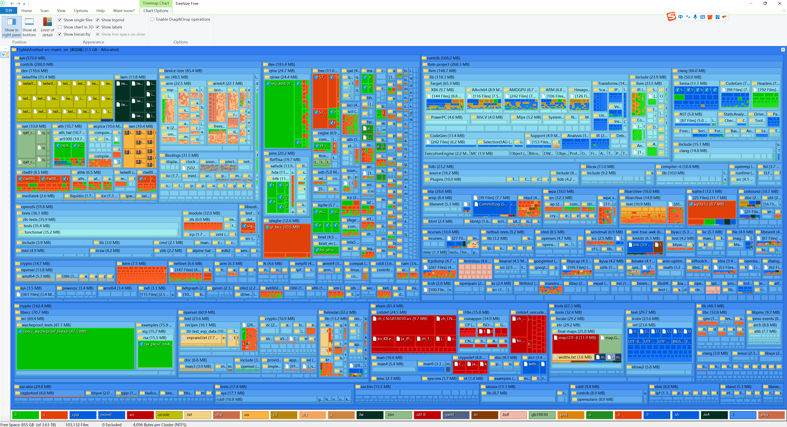

# 第 24.2 节 FreeBSD 目录结构

FreeBSD 系统源代码概览：

FreeBSD 在设计上属于学院派，条理清晰。

|      路径      |                                       简介                                       |
| :------------: | :------------------------------------------------------------------------------: |
|     `/bin`     |                      在个用户和多用户环境下的基本工具目录。                      |
|    `/sbin`     |          在单用户和多用户环境下的存放系统程序和管理所需的基本实用目录。          |
|     `/etc`     |                                系统的配置和脚本。                                |
|   `/usr/bin`   |                                存放系统应用软件。                                |
|  `/usr/sbin`   |                   存放系统后台程序 和 系统工具 (由用户执行)。                    |
| `/usr/libexec` |                 存放系统实用或后台程序 (从另外的程序启动执行)。                  |
|     `/tmp`     |          临时文件。/tmp 目录中的内容，一般不会在系统重新启动之后保留。           |
|   `/var/log`   |                                存放各种系统日志。                                |
|   `/var/tmp`   | 临时文件。这些文件在系统重新启动时通常会保留，除非 /var 是一个内存中的文件系统。 |
|   `/var/run`   |                                用来存放 Pidfile。                                |

值得注意地是，FreeBSD 现在并不使用 `/proc` 以及 procfs。

对于用户安装的程序，允许写入的目录是：

- `/var/run`
- `/var/log`
- `/var/tmp`
- `/tmp`

用户安装的程序都统一在 `/usr/local` 下，比如：

- `/usr/local/bin`
- `/usr/local/sbin`
- `/usr/local/etc`
- `/usr/local/libexec`

简而言之：系统使用 `/usr`，用户使用 `/usr/local`。这点与 Linux 截然不同，虽然后者理论设计也是如此，但是实际上很难做到。

更多信息，请参考官方文档：

[https://docs.freebsd.org/en/books/handbook/dirstructure.html](https://docs.freebsd.org/en/books/handbook/dirstructure.html)
