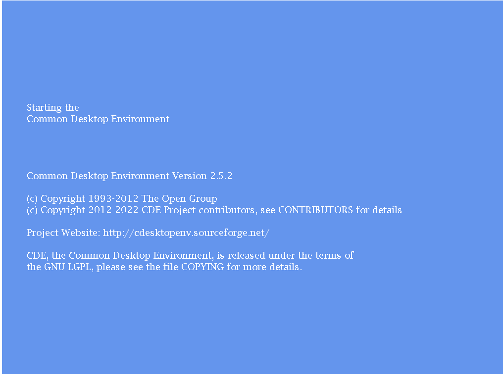
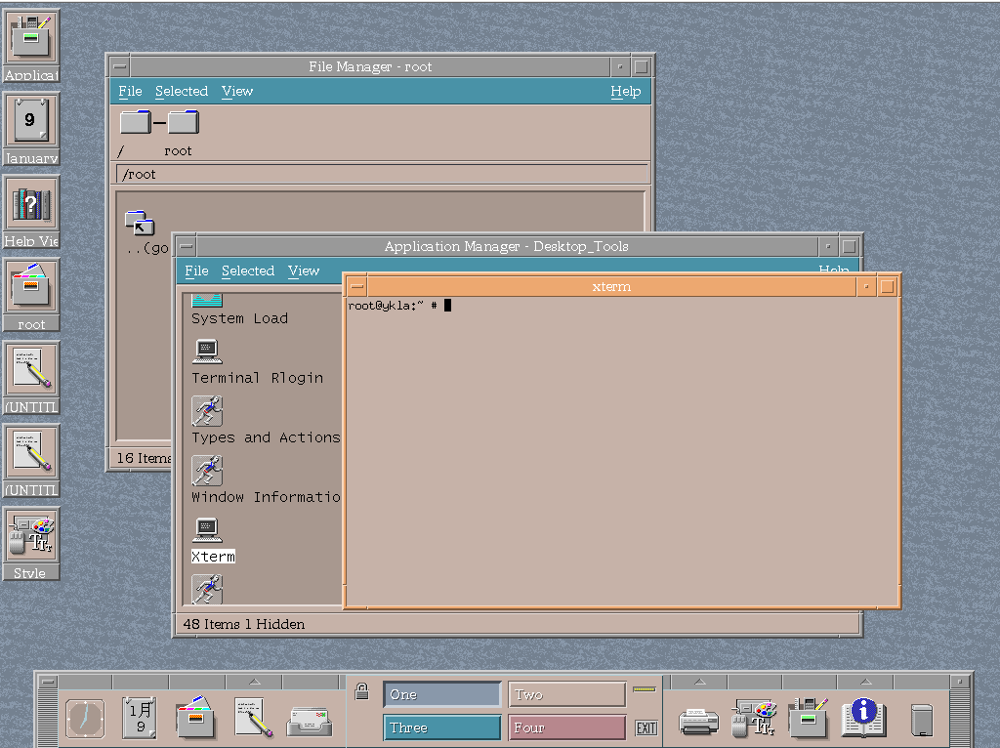
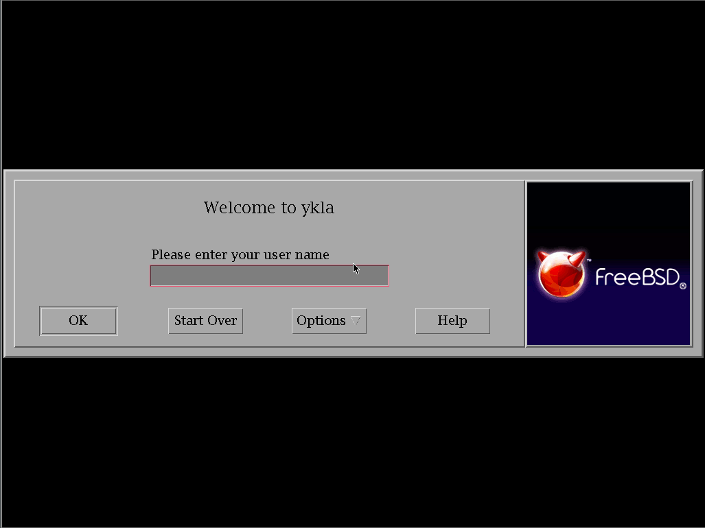

# 第 4.16 节 安装 CDE

CDE 是 Common Desktop Environment（通用桌面环境）的缩写。是一款历史悠久的桌面环境，常被用于 Unix 商业发行版。


## 安装软件

执行：

```sh
# pkg install xorg cde wqy-fonts xdg-user-dirs
```

或者：

```sh
# cd /usr/ports/x11/xorg/ && make install clean
# cd /usr/ports/x11/cde/ && make install clean
# cd /usr/ports/x11-fonts/wqy/ && make install clean # 文泉驿字体
# cd /usr/ports/devel/xdg-user-dirs/ && make install clean # 自动创建用户目录的工具
```

## 开启各项服务

查看安装后信息：

```sh
root@ykla:/home/ykla # pkg info -D cde
cde-2.5.2_4:
On install:
CDE - The Common Desktop Environment is an X Windows desktop environment
that was commonly used on commercial UNIX variants such as Sun Solaris,
HP-UX, and IBM AIX. Developed between 1993 and 1999, it has now been
released under an Open source license by The Open Group.

Common Desktop Environment requires the Subprocess Control Service,
dtcms, and the inetd super server to fully function.

First, add the following line to /etc/inetd.conf:

dtspc	stream	tcp	nowait	root	 /usr/local/dt/bin/dtspcd	/usr/local/dt/bin/dtspcd

Second, add the following line to /etc/services:

dtspc		6112/tcp # CDE Subprocess Control Service

# sysrc rpcbind_enable=YES
# sysrc dtcms_enable=YES
# sysrc inetd_enable=YES
# service rpcbind start && service dtcms start && service inetd start

Finally, make sure to add /usr/local/dt/bin to your path.

To start the Common Desktop Environment:
% env LANG=C startx /usr/local/dt/bin/Xsession

Alternatively, if you want to use the Login Manager as well, create
/usr/local/etc/X11/Xwrapper.config and add this line:

allowed_users=anybody

To start the Common Desktop Enviroment Login Manager:

% /usr/local/dt/bin/dtlogin -daemon

```

在 shell 中执行：

```sh
# sysrc rpcbind_enable="YES"
# sysrc dtcms_enable="YES"
# sysrc inetd_enable=yes
# ln -s /usr/local/dt/bin/Xsession ~/.xinitrc
# startx
```
	
将以下内容添加到 `/etc/inetd.conf`：

```sh
dtspc	stream	tcp	nowait	root	 /usr/local/dt/bin/dtspcd	/usr/local/dt/bin/dtspcd
```

将以下内容添加到 `/etc/services`：

```sh
dtspc		6112/tcp
```

登录管理器配置：

`/etc/rc.local` 加入：

```sh
/usr/local/dt/bin/dtlogin -l zh_CN.UTF-8
```

### 中文配置

编辑 `/etc/login.conf`：

找到 `default:\` 这一段，把 `:lang=C.UTF-8` 修改为 `:lang=zh_CN.UTF-8`。

刷新数据库：

```sh
# cap_mkdb /etc/login.conf
```

## 图片



每次启动时都会在这里卡上几分钟。




## 故障排除

- 无法中文化（似乎日历是中文）

待解决

- 从自带登录管理器进入鼠标动不了，`startx` 正常



待解决


## 参考文献

- [cde Common Desktop Environment](https://www.freshports.org/x11/cde)
- [Setting up Common Desktop Environment for modern use](https://forums.freebsd.org/threads/setting-up-common-desktop-environment-for-modern-use.69475/)，详细配置可参考此处
