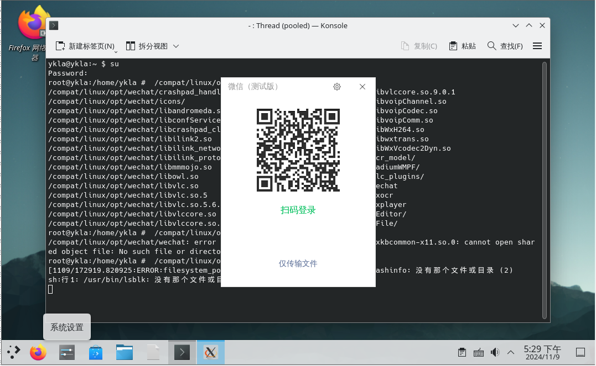
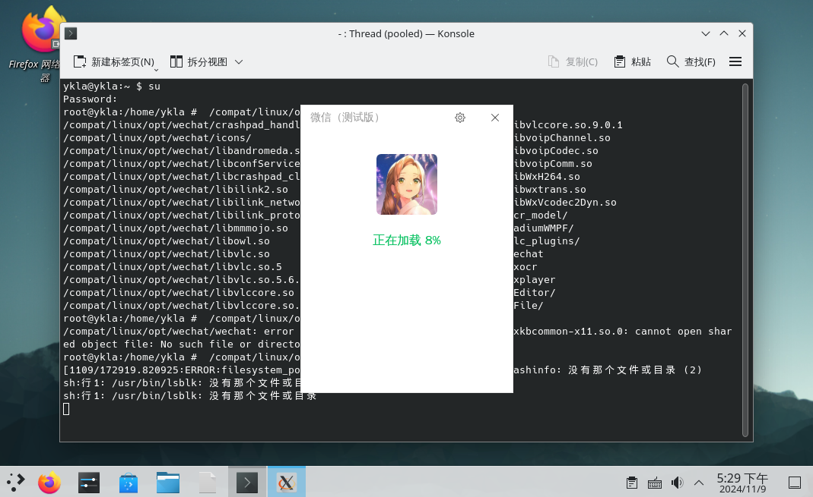
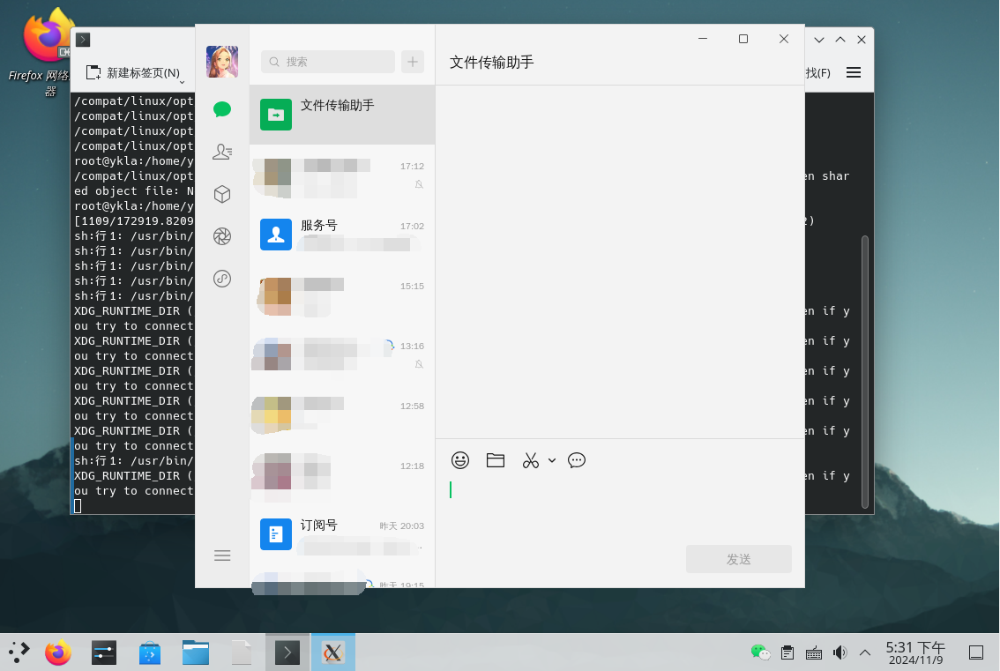

# 第 5.10 节 FreeBSD 安装微信（Linux 版）


## 基于 RockyLinux 兼容层（FreeBSD Port）

>**注意**
>
>请先参照本书其他章节先行安装 RockyLinux 兼容层（FreeBSD Port）

### 安装 rpm 工具

```sh
# pkg install rpm4
```

或者：

```
# cd /usr/ports/archivers/rpm4/ 
# make install clean
```

### 下载安装微信

#### 下载微信

官方地址：[微信 Linux 测试版](https://linux.weixin.qq.com/)

```sh
# fetch https://dldir1v6.qq.com/weixin/Universal/Linux/WeChatLinux_x86_64.rpm # 写作本文时链接如此，请自行获取最新链接
```

#### 安装微信

```sh
root@ykla:/ # cd /compat/linux/
root@ykla:/compat/linux # rpm2cpio < WeChatLinux_x86_64.rpm  | cpio -id #注意 WeChatLinux_x86_64.rpm 的路径改成你自己的
1393412 blocks
```

### 解决依赖问题

查看依赖：

```bash
root@ykla:/compat/linux # /compat/linux/usr/bin/bash # 切换到兼容层的 shell
bash-5.1# ldd /opt/wechat/wechat 
	linux-vdso.so.1 (0x00007fffffffe000)
	libglib-2.0.so.0 => /lib64/libglib-2.0.so.0 (0x000000080105c000)
	libatomic.so.1 => not found
	libXcomposite.so.1 => /lib64/libXcomposite.so.1 (0x0000000801197000)
	libXrender.so.1 => /lib64/libXrender.so.1 (0x000000080119c000)
	libXrandr.so.2 => /lib64/libXrandr.so.2 (0x00000008011a9000)
	libbz2.so.1.0 => not found
	libandromeda.so => /opt/wechat/libandromeda.so (0x000000080aa00000)
	libconfService.so => /opt/wechat/libconfService.so (0x000000080b200000)
	libilink2.so => /opt/wechat/libilink2.so (0x000000080b600000)
	libilink_network.so => /opt/wechat/libilink_network.so (0x000000080ba00000)
	libilink_protobuf.so => /opt/wechat/libilink_protobuf.so (0x000000080c600000)
	libowl.so => /opt/wechat/libowl.so (0x000000080ca00000)
	libvoipChannel.so => /opt/wechat/libvoipChannel.so (0x000000080ce00000)
	libvoipCodec.so => /opt/wechat/libvoipCodec.so (0x000000080d200000)
	libvoipComm.so => /opt/wechat/libvoipComm.so (0x000000080f200000)
	libWxH264.so => /opt/wechat/libWxH264.so (0x000000080f600000)
	libWxVcodec2Dyn.so => /opt/wechat/libWxVcodec2Dyn.so (0x000000080fc00000)
	libwxtrans.so => /opt/wechat/libwxtrans.so (0x0000000810800000)
	libmmmojo.so => /opt/wechat/libmmmojo.so (0x0000000812600000)
	libz.so.1 => /lib64/libz.so.1 (0x00000008011bc000)
	libdl.so.2 => /lib64/libdl.so.2 (0x00000008011d6000)
	libxkbcommon.so.0 => /lib64/libxkbcommon.so.0 (0x000000080a9a7000)
	libxkbcommon-x11.so.0 => not found
	libxcb-glx.so.0 => /lib64/libxcb-glx.so.0 (0x00000008011db000)
	libxcb-xkb.so.1 => /lib64/libxcb-xkb.so.1 (0x000000080b12c000)
	libxcb-randr.so.0 => /lib64/libxcb-randr.so.0 (0x000000080a9ec000)
	libxcb-icccm.so.4 => not found
	libxcb-shm.so.0 => /lib64/libxcb-shm.so.0 (0x00000008011fa000)
	libxcb-render.so.0 => /lib64/libxcb-render.so.0 (0x000000080b14a000)
	libxcb-image.so.0 => not found
	libxcb-xfixes.so.0 => /lib64/libxcb-xfixes.so.0 (0x000000080b15a000)
	libxcb-shape.so.0 => /lib64/libxcb-shape.so.0 (0x000000080b166000)
	libxcb-sync.so.1 => /lib64/libxcb-sync.so.1 (0x000000080b16b000)
	libxcb-render-util.so.0 => not found
	libxcb-keysyms.so.1 => not found
	libxcb.so.1 => /lib64/libxcb.so.1 (0x000000080b175000)
	libX11.so.6 => /lib64/libX11.so.6 (0x000000080c82e000)
	libX11-xcb.so.1 => /lib64/libX11-xcb.so.1 (0x000000080b1a2000)
	libfontconfig.so.1 => /lib64/libfontconfig.so.1 (0x000000080b1a7000)
	libdbus-1.so.3 => /lib64/libdbus-1.so.3 (0x000000080b99c000)
	libstdc++.so.6 => /lib64/libstdc++.so.6 (0x0000000812a00000)
	libm.so.6 => /lib64/libm.so.6 (0x000000080cd0f000)
	libgcc_s.so.1 => /lib64/libgcc_s.so.1 (0x000000080b5b8000)
	libpthread.so.0 => /lib64/libpthread.so.0 (0x000000080b1f8000)
	libc.so.6 => /lib64/libc.so.6 (0x0000000812e00000)
	/lib64/ld-linux-x86-64.so.2 (0x0000000001021000)
	libpcre.so.1 => /lib64/libpcre.so.1 (0x000000080c57d000)
	libXext.so.6 => /lib64/libXext.so.6 (0x000000080b5d3000)
	libnss3.so => /lib64/libnss3.so (0x000000080f434000)
	libnssutil3.so => /lib64/libnssutil3.so (0x000000080c976000)
	libnspr4.so => /lib64/libnspr4.so (0x000000080c9aa000)
	librt.so.1 => /lib64/librt.so.1 (0x000000080b5e8000)
	libXau.so.6 => /lib64/libXau.so.6 (0x000000080b5ed000)
	libfreetype.so.6 => /lib64/libfreetype.so.6 (0x000000080f115000)
	libxml2.so.2 => /lib64/libxml2.so.2 (0x000000080fa65000)
	libsystemd.so.0 => /lib64/libsystemd.so.0 (0x00000008124b9000)
	libplc4.so => /lib64/libplc4.so (0x000000080b5f5000)
	libplds4.so => /lib64/libplds4.so (0x000000080b9ef000)
	libbz2.so.1 => /lib64/libbz2.so.1 (0x000000080c9ed000)
	libpng16.so.16 => /lib64/libpng16.so.16 (0x000000080f569000)
	libharfbuzz.so.0 => /lib64/libharfbuzz.so.0 (0x000000081280a000)
	libbrotlidec.so.1 => /lib64/libbrotlidec.so.1 (0x000000080cdea000)
	liblzma.so.5 => /lib64/liblzma.so.5 (0x000000080d1d1000)
	libcap.so.2 => /lib64/libcap.so.2 (0x000000080b9f4000)
	libgcrypt.so.20 => /lib64/libgcrypt.so.20 (0x0000000812c29000)
	libzstd.so.1 => /lib64/libzstd.so.1 (0x00000008128d9000)
	liblz4.so.1 => /lib64/liblz4.so.1 (0x000000080f1d9000)
	libgraphite2.so.3 => /lib64/libgraphite2.so.3 (0x000000080f5a0000)
	libbrotlicommon.so.1 => /lib64/libbrotlicommon.so.1 (0x000000080f5c1000)
	libgpg-error.so.0 => /lib64/libgpg-error.so.0 (0x0000000812596000)
```

- 解决缺少的依赖 `libatomic.so.1`：

```sh
# pkg install linux-rl9-libatomic
```
或者：

```sh
# cd /usr/ports/devel/linux-rl9-libatomic/ && make install clean
```

- 继续解决缺少的依赖 `libbz2.so.1.0`：

```sh
root@ykla:/compat/linux # mv /compat/linux/lib64/libbz2.so.1.0.8 /compat/linux/lib64/libbz2.so.1.0  # 重命名所需的库
```

>**技巧**
>
>`libbz2.so.1` 这个库本来就有，但是名字不一样，你找不到的话，自己输入 `ls /compat/linux/lib64/libbz2` 然后按一下 **TAB** 补全看一下你的名字是什么。

- 解决依赖 `libxkbcommon-x11.so.0`:

```sh
# fetch https://dl.rockylinux.org/pub/rocky/9/devel/x86_64/os/Packages/l/libxkbcommon-x11-1.0.3-4.el9.x86_64.rpm
# cd /compat/linux/
root@ykla:/compat/linux # rpm2cpio < libxkbcommon-x11-1.0.3-4.el9.x86_64.rpm  | cpio -id 
82 blocks
```

>**技巧**
>
>当找不到 rockylinux 的某某库时，可以到 <https://rockylinux.pkgs.org/> 搜索。


- 解决依赖 `libxcb-icccm.so.4`：

```sh
# fetch https://dl.rockylinux.org/pub/rocky/9/AppStream/x86_64/os/Packages/x/xcb-util-wm-0.4.1-22.el9.x86_64.rpm
# cd /compat/linux/
root@ykla:/compat/linux #  rpm2cpio < xcb-util-wm-0.4.1-22.el9.x86_64.rpm  | cpio -id 
175 blocks
```

- 解决其他 xcb 库相关依赖：

```sh
# pkg install linux-rl9-xcb-util
```

或者

```sh
# cd /usr/ports/x11/linux-rl9-xcb-util/ 
# make install clean
```

### 启动微信

```sh
# /compat/linux/opt/wechat/wechat
```

功能正常：






