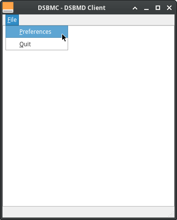
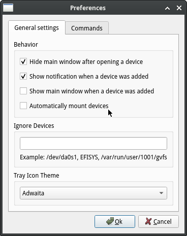

# 第 6.8 节 自动挂载文件系统


## automount 自动挂载

支持 NTFS/FAT/exFAT/EXT2/EXT3/EXT4/UFS/HFS/XFS/ISO9660。

安装：

```sh
# pkg install automount
```
或：

```sh
# cd /usr/ports/filesystems/automount/
# make install clean
```

即可。

## DSBMD 自动挂载

DSBMD 是 FreeBSD 的介质/文件系统类型检测守护进程，它允许客户端挂载存储设备。它配置为开箱即用。

### 安装

```sh
# pkg install dsbmd      # 这是守护进程
# pkg install dsbmc-cli  # 命令行客户端
# pkg install dsbmc      # QT 界面客户端
```

或：

```sh
# cd /usr/ports/filesystems/dsbmd/ && make install clean 	 # 这是守护进程
# cd /usr/ports/filesystems/dsbmc-cli/ && make install clean # 命令行客户端
# cd /usr/ports/filesystems/dsbmc/ && make install clean 	 # QT 界面客户端
```

客户端选一个装就可以，桌面使用的推荐选择 `dsbmc` 即可，较为方便。

### 配置方法

>**技巧**
>
>使用时分为两部分，守护进程和客户端。客户端可以请求 DSBMD 挂载、卸载和弹出介质，或设置 CD/DVD 读取速度。守护进程执行客户端的请求。守护进程是系统进程，所以可以执行所有的操作，客户端是普通的用户进程，所以任何用户都可以执行。没权限的用户请求挂载不会执行，守护程序会根据配置文件中用户和组的设定判断。

- 守护进程配置文件在 `/usr/local/etc/dsbmd.conf`。

- 默认配置 `wheel` 和 `operator` 组用户可以进行挂载，如果不是这两个组可以先修改配置文件（配置文件简单易懂） 

启用守护进程：

```sh
# sysrc dsbmd_enable=YES
# service dsbmd start
```


#### QT 客户端

`dsbmc` 客户端在运行时，才会向守护进程发送请求，所以要在桌面上启动客户端。下面以 xfce 为例。

打开 `dsbmc`


在托盘区域可以看到 `dsbmc` 的图标


打开主窗口，`preferences`->`general settings`,勾选 `automatically mount devices` 以使用自动挂载

    



插入 U 盘后，会在桌面提示：


默认挂载在 `/media/` 下面，属主为客户端用户。


#### 命令行客户端

```sh
% dsbmc-cli -h
Options:
-L <event> <command> [arg ...] ; Listen for <event>, and execute <command> every
                                 time the event is received. Possible events are
                                 mount, unmount, add, and remove.
-U <time>                        Auto-unmount. Try to unmount automounted de-
                                 vices every <time> seconds.
-a [-L ...]                      Automount. Wait for devices added to the sys-
                                 tem, and mount them.
-b dev1,dev2,...                 Define a comma-separated list of devices
                                 and/or volume labels to ignore if the -a option
                                 is given. Volume labels must be prefixed by
                                 "volid=".
-e <device>                      Eject <device>
-e <mount point>                 Eject the device mounted on <mount point>
-f                               Force operation even if device is busy.
-i <disk image>                  Create a memory disk to access the given image.
-l                               List available devices supported by DSBMD.
-m <device>                      Mount <device>
-s <device>                      Query storage capacity of <device>
-u <device>                      Unmount <device>
-u <mount point>                 Unmount <device> mounted on <mount point>
-v <speed> <device>              Set reading <speed> of the CD/DVD <device>
```

- 常用参数：
  - `-e` 弹出
  - `-m` 挂载
  - `u` 卸载
- 可以在 shell 启动文件，或 `.xinitrc`、`.xprofile` 等桌面相关的文件中写入下面的命令以便在后台自动挂载(当然，无界面提示)

```sh
dsbmc-cli -a&
```

### 守护进程配置

默认配置已经可以很好的工作，但要作更细致的挂载控制，则要修改守护进程的配置文件。配置文件在 `/usr/local/etc/dsbmd.conf`。

#### usermount 说明


```sh
# usermount - Controls whether DSBMD mounts devices as user. This requires the
# sysctl variable vfs.usermount is set to 1.
usermount = true
```

配置文件中，已经默认打开 `usermount`，但要启动还要设置 `vfs.usermount` 系统变量,在 `/etc/sysctl.conf` 中写入

```sh
vfs.usermount=1
```

- 开启 `usermount` 后，挂载使用的程序以用户为属主在用户空间执行，不开启 `usermount` ，挂载程序以 `root` 用户为属主。
- 无论是否开启 `usermount`，挂载点的属主都是客户端用户。

#### 设置允许自动挂载的用户

```sh
# allow_users - Comma separated list of users who are allowed to connect.
# allow_users = jondoe, janedoe

# allow_groups - Comma separated list of groups whose members are allowed
# to connect.
allow_groups = operator, wheel
```

修改 `allow_users` 和 `allow_groups` 来管理可以使用自动挂载的用户。

#### 修改挂载点及其下文件目录访问权限（示例为 NTFS）

以挂载 NTFS 文件系统为例，修改文件访问权限为 `640`（rw-r-----)，目录访问权限为 `750`(rwxr-x---)。 

```sh
...
ntfs_mount_cmd = "/usr/local/bin/ntfs-3g -o \"uid=${DSBMD_UID},gid=${DSBMD_GID}\" ${DSBMD_DEVICE} \"${DSBMD_MNTPT}\""
...
ntfs_mount_cmd_usr = "/sbin/mount_fusefs auto \"${DSBMD_MNTPT}\" ntfs-3g ${DSBMD_DEVICE} \"${DSBMD_MNTPT}\""
...
```

有关 NTFS 的配置有两条，开启 `usermount` 则使用 `ntfs_mount_cmd_usr`,否则使用 `ntfs_mount_cmd`。修改如下：

```sh
...
ntfs_mount_cmd = "/usr/local/bin/ntfs-3g -o \"uid=${DSBMD_UID},gid=${DSBMD_GID},fmask=137,dmask=027\" ${DSBMD_DEVICE} \"${DSBMD_MNTPT}\""
...
ntfs_mount_cmd_usr = "/sbin/mount_fusefs auto \"${DSBMD_MNTPT}\" ntfs-3g -o fmask=137,dmask=027 r${DSBMD_DEVICE} \"${DSBMD_MNTPT}\""
...
```

这里为 ntfs-3g 的挂载选项提供的 `fmask=137,dmask=027` 掩码参数，以控制挂载选项。

